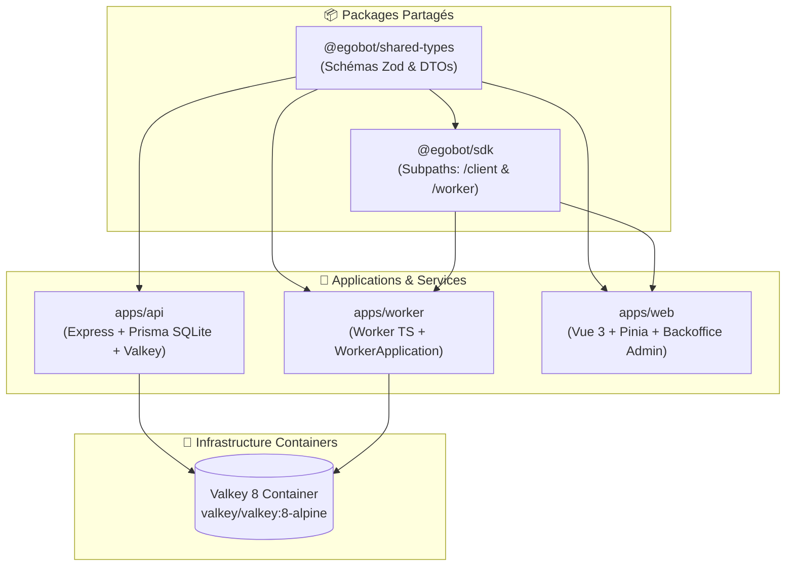

# 🚀 EgoBot Monorepo 100% TypeScript (`egobot`)

Scaffold d'architecture monorepo hautement modulaire et réutilisable **100% TypeScript**, articulé autour de `pnpm workspaces`, `Turborepo` et `Valkey 8` (conçu pour l'orchestration d'agents réactifs, d'inférence LLM et de plateformes SaaS).

---

## 🏗️ Vue d'Ensemble de l'Architecture Monorepo



---

## 📂 Navigation & Documentation des Projets

Chaque projet et package du workspace possède sa propre documentation dédiée avec son propre guide d'extension :

| Projet / Package | Rôle & Composants | Lien vers la Documentation |
| :--- | :--- | :--- |
| 📦 **`packages/shared-types`** | Contrats Zod & DTOs universels (`User`, `Conversation`, `Job`, `SSE`). | 📄 [packages/shared-types/README.md](file:///home/tboutin/Documents/prod-llm_4/scaffold-monorepo/packages/shared-types/README.md) |
| 📦 **`packages/sdk`** | SDK universel (`/client` pour Web REST/SSE & `/worker` pour Worker TS). | 📄 [packages/sdk/README.md](file:///home/tboutin/Documents/prod-llm_4/scaffold-monorepo/packages/sdk/README.md) |
| ⚡ **`apps/api`** | Backend Express, BDD Prisma SQLite WAL, EventBus & Valkey Streams. | 📄 [apps/api/README.md](file:///home/tboutin/Documents/prod-llm_4/scaffold-monorepo/apps/api/README.md) |
| ⚙️ **`apps/worker`** | Worker d'inférence en Pure TypeScript (`WorkerApplication`). | 📄 [apps/worker/README.md](file:///home/tboutin/Documents/prod-llm_4/scaffold-monorepo/apps/worker/README.md) |
| 💻 **`apps/web`** | Interface Web Vue 3 + Chat Store Pinia (Fallback SSE 6s) + Backoffice. | 📄 [apps/web/README.md](file:///home/tboutin/Documents/prod-llm_4/scaffold-monorepo/apps/web/README.md) |

---

## ⚙️ Comment Fonctionne ce Monorepo ?

Le monorepo repose sur le duo **`pnpm workspaces`** (pour la gestion des paquets et le linking local) et **`Turborepo 2.0`** (pour l'orchestration des tâches et le cache intelligent).

### 1. Linking Local & Symlinks (`workspace:*`)
Le fichier `pnpm-workspace.yaml` déclare l'ensemble des projets du workspace (`apps/*` et `packages/*`).
Lorsque `apps/api` déclare `"@my-llm/shared-types": "workspace:*"` dans son `package.json`, `pnpm` crée automatiquement un **lien symbolique local** vers le code compilé dans `packages/shared-types/dist`. Aucune publication sur un registre externe (NPM) n'est nécessaire.

### 2. Graphe de Dépendances & Cache (`turbo.json`)
Turborepo analyse le graphe de dépendances (*DAG - Directed Acyclic Graph*) pour exécuter les tâches dans le meilleur ordre possible :
- Lors de la commande `pnpm build`, Turborepo compile d'abord `shared-types`, puis `sdk`, et enfin en parallèle `api`, `worker` et `web`.
- **Cache Hit** : Si le code source d'un package n'a pas changé, Turborepo réutilise instantanément les artefacts du cache sans re-compiler (`cache hit`).

---

## 🔄 Comment Mettre à Jour les Dépendances du Monorepo ?

### 1. Mettre à jour de manière interactive TOUT le Monorepo
Pour mettre à jour les dépendances de l'ensemble des applications et packages en une seule commande interactive :
```bash
pnpm update -r --interactive --latest
```
*(Le drapeau `-r` ou `--recursive` applique la commande sur l'ensemble des workspaces).*

### 2. Mettre à jour les dépendances d'un projet spécifique
Pour mettre à jour ou ajouter une dépendance dans une seule application (ex: `apps/api` ou `packages/sdk`) :
```bash
# Mettre à jour une dépendance spécifique dans l'API
pnpm --filter @my-llm/api update express@latest

# Ajouter ou mettre à jour un paquet dans shared-types
pnpm --filter @my-llm/shared-types add zod@latest
```

### 3. Mettre à jour les dépendances de la Racine (Turbo, TypeScript)
Pour mettre à jour les outils d'infrastructure situés à la racine (`devDependencies` racine) :
```bash
pnpm add -Dw turbo@latest typescript@latest
```
*(Le drapeau `-w` ou `--workspace-root` cible spécifiquement la racine).*

---

## ⚡ Guide de Démarrage Rapide du Monorepo

### 1. Démarrer le conteneur Valkey 8
```bash
docker compose up -d
```

### 2. Effectuer la migration BDD (Prisma SQLite WAL)
```bash
pnpm db:migrate
```

### 3. Lancer l'ensemble des applications en mode développement
```bash
pnpm dev
```
*Turborepo lance simultanément l'API Express on `http://localhost:8000`, le Worker TS et le Client Web Vue 3 on `http://localhost:3000`.*

### 4. Compiler l'intégralité du Monorepo
```bash
pnpm build
```

## 📦 Build de Production, Versionnement & Releases

### 1. Compiler l'ensemble du Monorepo pour la Production

Pour compiler l'intégralité du monorepo (validation TypeScript + bundles de production Vite) :
```bash
pnpm build
```
*Turborepo orchestre la compilation de `shared-types` et `sdk`, puis génère les bundles optimisés dans `apps/api/dist`, `apps/worker/dist` et `apps/web/dist`.*

Pour compiler uniquement une application spécifique :
```bash
pnpm --filter @my-llm/web build
pnpm --filter @my-llm/api build
```

---

### 2. Gestion des Versions & Releases (Workflow Changesets)

Pour gérer le versionnement des 5 projets du monorepo (SemVer: `major.minor.patch`) et générer des Changelogs automatiques, le monorepo est compatible avec **Changesets** (`@changesets/cli`) :

#### Étape A : Déclarer un Changement (Feature / Fix)
```bash
pnpm changeset
```
*Un assistant interactif vous demande quels packages ont été modifiés (patch, minor, major) et saisit le message pour le changelog.*

#### Étape B : Mettre à jour les numéros de Version & Changelogs
```bash
pnpm changeset version
```
*Changesets met à jour automatiquement les numéros de version dans `package.json` et génère les fichiers `CHANGELOG.md`.*

#### Étape C : Taguer Git & Publier la Release
```bash
git add .
git commit -m "chore(release): version v1.0.0"
git tag -a v1.0.0 -m "Release v1.0.0"
git push origin main --tags
```

---

### 3. Déploiement & Containerisation Docker (Production)

Chaque application peut être exécutée en production via Node.js ou conteneurisée :

```bash
# Lancer l'API en mode production
cd apps/api
pnpm start

# Lancer le Worker TS en production
cd apps/worker
pnpm start

# Servir l'application Web Vue 3 (build statique Nginx / Vercel)
cd apps/web
pnpm preview
```

---

### 4. Gestion Automatique des Changelogs

Dans un monorepo, chaque package possède son propre journal de modifications (`CHANGELOG.md`) en plus du `CHANGELOG.md` global de la racine :

1. **Publication d'une Note de Changement** :
   Chaque développeur exécutant `pnpm changeset` génère un fichier Markdown temporaire dans `.changeset/` décrivant la modification (`Patch`, `Minor` ou `Major`).
2. **Génération Automatique lors de la Release** :
   Lors de la commande `pnpm changeset version`, `Changesets` agrège toutes les notes temporaires, met à jour le fichier `CHANGELOG.md` de chaque package impacté (`packages/shared-types`, `packages/sdk`, `apps/api`, etc.) avec la date et le numéro de version SemVer, puis nettoie les notes temporaires.

Exemple de structure générée dans `packages/sdk/CHANGELOG.md` :
```markdown
# @my-llm/sdk

## 1.1.0 (2026-07-22)

### Minor Changes
- Add subpath exports for /client and /worker
- Support Valkey 8 Streams connection

### Patch Changes
- Fix EventSource lastEventId reconnection logic
```

### 3. Containerisation Docker par Projet & Environnement (`dev`, `test`, `prod`)

Le monorepo intègre une suite complète de Dockerfiles par projet (`apps/api` et `apps/web`) et de fichiers Docker Compose par environnement :

#### A. Fichiers Docker par Projet
* **`apps/api/`** :
  - `Dockerfile.dev` : Hot-reload en développement avec `tsx watch`.
  - `Dockerfile.test` : Execution automatique des tests Vitest API.
  - `Dockerfile.prod` : Image Multi-Stage ultra-légère issue de `pnpm deploy`.
* **`apps/web/`** :
  - `Dockerfile.dev` : Serveur de dev Vite (Hot Reload).
  - `Dockerfile.test` : Execution des tests unitaires Frontend.
  - `Dockerfile.prod` : Compilation statique Vue 3 + Serveur web **Nginx Alpine**.

#### B. Commandes Docker Compose par Environnement
```bash
# 🛠️ 1. Lancer tout le stack en Développement (Hot-Reload)
docker compose -f docker-compose.dev.yml up --build

# 🧪 2. Lancer la suite de Tests automatisés en conteneur
docker compose -f docker-compose.test.yml up --build --exit-code-from api-test

# 🚀 3. Lancer le stack complet optimisé pour la Production
docker compose -f docker-compose.prod.yml up -d --build
```

---

### 4. Integration CI/CD (GitHub Actions)

Pour exécuter vos tests et builder le monorepo dans GitHub Actions :
```yaml
name: CI/CD Pipeline
on: [push, pull_request]

jobs:
  build:
    runs-on: ubuntu-latest
    steps:
      - uses: actions/checkout@v4
      - uses: pnpm/action-setup@v4
      - uses: actions/setup-node@v4
        with:
          node-version: 20
          cache: 'pnpm'
      - run: pnpm install
      - run: pnpm build
```

---

## 🛡️ Licence
Projet sous licence MIT.
