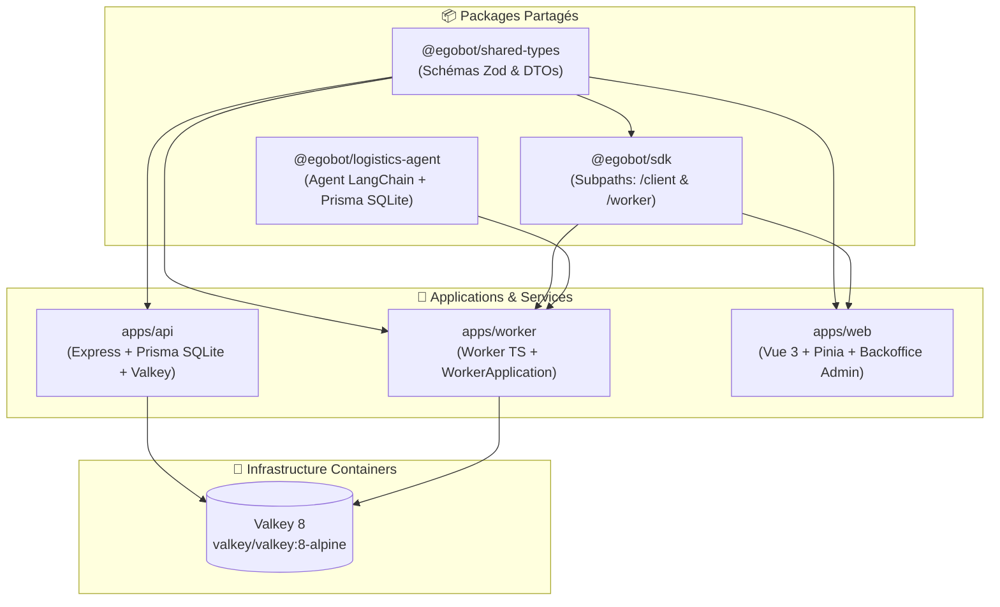

# 🚀 EgoBot Monorepo 100% TypeScript (`egobot`)

Scaffold d'architecture monorepo hautement modulaire et réutilisable **100% TypeScript**, articulé autour de `pnpm workspaces`, `Turborepo` et `Valkey 8` (conçu pour l'orchestration d'agents réactifs, d'inférence LLM et de plateformes SaaS).

---

## 🏗️ Vue d'Ensemble de l'Architecture Monorepo



> 💡 **Bases de Données SQLite** :
> L'ensemble du monorepo fonctionne désormais sur **SQLite** (`apps/api` et `packages/logistics-agent`).
> En développement avec Docker Compose, les bases sont isolées dans des volumes nommés ext4 (`api_dev_sqlite` et `logistics_dev_sqlite`), garantissant l'intégrité du mode WAL sans risque de corruption sur systèmes de fichiers virtuels.

---

## 📂 Navigation & Documentation des Projets

> 🎯 **Sujet Central du Projet : Le Worker d'Inférence & Tool Calling**
> Le composant principal d'EgoBot est son **Worker TypeScript** (`apps/worker`) et son **Agent Logistique** (`packages/logistics-agent`).
> Pour tout comprendre sur le traitement des jobs Valkey Streams, le fonctionnement du Tool Calling, l'interception de graphiques Chart.js / Mermaid, ou pour ajouter de nouveaux outils et de nouvelles sources de données, consultez directement le guide complet :
> 
> 👉 **[Documentation Complète du Worker & Tool Calling](apps/worker/README.md)**

| Projet / Package | Rôle & Composants | Lien vers la Documentation |
| :--- | :--- | :--- |
| ⚙️ **`apps/worker`** | **Cœur d'inférence** (`WorkerApplication`), exécution des modèles `CHATBOT` & `LOGISTICS`, Tool Calling & streaming SSE. | 📄 [apps/worker/README.md](apps/worker/README.md) |
| 📦 **`packages/logistics-agent`** | **Agent LangChain** de suivi logistique (19 outils, Prisma SQLite, isolation client). | 📄 [packages/logistics-agent/README.md](packages/logistics-agent/README.md) |
| 📦 **`packages/sdk`** | SDK universel (`/client` pour Web REST/SSE & `/worker` pour Worker TS). | 📄 [packages/sdk/README.md](packages/sdk/README.md) |
| 📦 **`packages/shared-types`** | Contrats Zod & DTOs universels (`User`, `Conversation`, `Job`, `SSE`). | 📄 [packages/shared-types/README.md](packages/shared-types/README.md) |
| 💻 **`apps/web`** | Interface Web Vue 3 + Chat Store Pinia + Rendu Mermaid/Chart.js. | 📄 [apps/web/README.md](apps/web/README.md) |
| ⚡ **`apps/api`** | Backend d'ingestion Express & passerelle Valkey Streams. | 📄 [apps/api/README.md](apps/api/README.md) |

---

## 📋 Prérequis

Avant de lancer le projet sur votre machine, assurez-vous de disposer de :
- **Node.js** `>= 20.x` (recommandé : `22.x LTS`)
- **pnpm** `>= 9.x` (activable en une commande via `corepack enable pnpm`)
- **Docker & Docker Compose** (pour le mode conteneurisé standard)
- *(Optionnel pour le mode natif)* : Linux ou macOS (requis par le binaire `@valkey/valkey-glide` de l'API)

---

## ⚡ Guide de Démarrage Rapide (Recommandé — Fonctionne sur Windows, macOS et Linux)

Le mode de développement conteneurisé est la solution recommandée car il garantit un environnement 100% reproductible sans aucune compilation C++ locale.

### 1. Installer les dépendances
```bash
pnpm install
```

### 2. Initialiser l'environnement (Fichier unique à la racine)

```bash
pnpm env:init
```

*Cette commande initialise le fichier `/.env` racine depuis `.env.example` et génère automatiquement un secret JWT cryptographique sécurisé. Toutes les variables (ports, connexions Valkey, URLs SQLite) sont pré-configurées avec des valeurs saines.*

### 3. Démarrer l'environnement complet

```bash
pnpm dev
```

*Ce qui se passe automatiquement sous le capot :*

1. **Infrastructure** : Démarrage du cluster en mémoire `valkey` (`port 6379`).
2. **Auto-Migrate & Seeds** : Le conteneur éphémère `scaffold_migrator_dev` s'exécute en premier :
   - Applique les migrations Prisma des deux bases SQLite (`dev.db` et `logistics.db`).
   - Crée le compte administrateur de test (`admin@egobot.local`).
   - Génère le jeu de test logistique (150 commandes, livraisons, stocks) et y rattache le compte admin.
3. **Services applicatifs** : Une fois les bases prêtes, `api` (`http://localhost:8000`), `worker` et `web` (`http://localhost:3000`) démarrent en direct avec hot-reload.

### 4. Utiliser l'application

- Ouvrir **`http://localhost:3000`** dans votre navigateur.
- Se connecter avec les identifiants de test pré-configurés :
  - **Email** : `admin@egobot.local`
  - **Mot de passe** : `Password123!`
- Sélectionner le modèle **LOGISTICS** dans le chat et tester :
  *« Où en est ma dernière commande ? »* ou *« Liste mes livraisons »*.

### 5. Arrêter ou réinitialiser

```bash
# Arrêter la stack proprement (ou presser Ctrl+C dans le terminal)
pnpm dev:down

# Reconstruire les images après un changement de package.json
pnpm dev:build

# Réinitialiser les bases de données Docker à blanc
pnpm dev:reset
```

---

## ⚡ Guide de Démarrage Natif (macOS / Linux uniquement)

Pour exécuter les processus Node.js directement sur la machine hôte :

```bash
# 1. Initialiser l'environnement
pnpm env:init

# 2. Démarrer uniquement l'infrastructure Valkey
pnpm infra:up

# 3. Migrer et peupler les deux bases de données locales
pnpm db:migrate
pnpm db:seed

# 4. Lancer toutes les applications en mode dev (Turborepo)
pnpm dev:native
```

### Outils de Base de Données (Prisma Studio)

```bash
# Explorer les comptes et conversations API (port 5555)
pnpm db:studio:api

# Explorer les commandes et stocks logistiques (port 5556)
pnpm db:studio:logistics
```

---

## 🔄 Comment Mettre à Jour les Dépendances du Monorepo ?

### 1. Mettre à jour de manière interactive TOUT le Monorepo

```bash
pnpm update -r --interactive --latest
```

*(Le drapeau `-r` ou `--recursive` applique la commande sur l'ensemble des workspaces).*

### 2. Mettre à jour les dépendances d'un projet spécifique

```bash
# Mettre à jour une dépendance spécifique dans l'API (nom de package non scopé : "api")
pnpm --filter api update express@latest

# Ajouter ou mettre à jour un paquet dans shared-types
pnpm --filter @egobot/shared-types add zod@latest
```

### 3. Mettre à jour les dépendances de la Racine (Turbo, TypeScript)

```bash
pnpm add -Dw turbo@latest typescript@latest
```

*(Le drapeau `-w` ou `--workspace-root` cible spécifiquement la racine).*

---

## 📦 Build de Production, Tests & Releases

### 1. Compiler l'ensemble du Monorepo pour la Production

```bash
pnpm build
```

*Turborepo orchestre la compilation de `shared-types`, `sdk`, `logistics-agent`, puis génère les bundles dans `apps/api/dist`, `apps/worker/dist` et `apps/web/dist`.*

Pour compiler uniquement une application spécifique :

```bash
pnpm --filter @egobot/web build
pnpm --filter api build
```

### 2. Lancer les tests

`pnpm test` à la racine ne couvre que `packages/*` (Vitest) — `apps/api`, `apps/worker` et `apps/web` ont chacun leur propre runner et doivent être lancés individuellement :

```bash
# packages/* uniquement (Vitest, à la racine)
pnpm test

# Chaque application/package individuellement
pnpm --filter api test                    # Vitest
pnpm --filter @egobot/worker test         # node:test
pnpm --filter @egobot/web test            # Vitest
pnpm --filter @egobot/sdk test            # Vitest
pnpm --filter @egobot/shared-types test   # Vitest
pnpm --filter @egobot/logistics-agent test # Vitest
```

### 3. Vérification des types & lint

```bash
pnpm --filter api check-types
pnpm lint
```

---

## 🐳 Containerisation Docker par Projet & Environnement

Chaque application dispose de trois Dockerfiles (`dev`, `test`, `prod`), et le monorepo fournit un fichier Docker Compose par environnement.

### A. Fichiers Docker par Projet

- **`apps/api/`** :
  - `Dockerfile.dev` : Hot-reload avec `tsx watch` (Node 22-alpine).
  - `Dockerfile.test` : Exécution automatique des tests Vitest API.
  - `Dockerfile.prod` : Image multi-stage issue de `pnpm deploy`.

- **`apps/worker/`** :
  - `Dockerfile.dev` : `tsx watch`, build préalable des dépendances workspace (`@egobot/logistics-agent`, `@egobot/sdk`, `@egobot/shared-types`) via `turbo build --filter=@egobot/worker^...`.
  - `Dockerfile.prod` : Image multi-stage + cible optionnelle `migrator` (applique les migrations PostgreSQL de `logistics-agent` avant démarrage).
- **`apps/web/`** :
  - `Dockerfile.dev` : Serveur de dev Vite (build préalable de `@egobot/sdk`).
  - `Dockerfile.test` : Exécution des tests unitaires Frontend.
  - `Dockerfile.prod` : Compilation statique Vue 3 + serveur Nginx Alpine.

### B. Commandes Docker Compose par Environnement

```bash
# 🛠️ 1. Stack complète en Développement (Hot-Reload)
docker compose -f docker-compose.dev.yml up -d --build

# 🧪 2. Suite de Tests automatisés en conteneur
docker compose -f docker-compose.test.yml up --build --exit-code-from api-test

# 🚀 3. Stack complète de Production
cp .env.example .env   # renseigner JWT_SECRET, POSTGRES_PASSWORD, OPENAI_API_KEY
docker compose -f docker-compose.prod.yml up -d --build
```

*(`docker-compose.prod.yml` refuse de démarrer si `JWT_SECRET`, `POSTGRES_PASSWORD` ou `OPENAI_API_KEY` sont absents — voir `.env.example` à la racine. Un conteneur éphémère `migrate` applique les migrations PostgreSQL avant que le `worker` ne démarre.)*

### C. Rebuilder un seul service après une modification de Dockerfile ou de dépendance

```bash
docker compose -f docker-compose.dev.yml up -d --build api
docker compose -f docker-compose.dev.yml up -d --build worker
docker compose -f docker-compose.dev.yml up -d --build web
```

---

## 🧭 Dépannage rapide

| Symptôme | Piste |
| :--- | :--- |
| `Cannot find module '@valkey/valkey-glide-win32-x64-msvc'` | Windows natif non supporté pour `apps/api` — passer par Docker (voir plus haut). |
| Le chatbot ne répond jamais (aucune erreur visible) | Vérifier que `worker` et `api` utilisent le même environnement normalisé (`dev`/`prod`) : `docker exec scaffold_valkey_dev valkey-cli KEYS "jobs:queue:*"` doit montrer des clés cohérentes des deux côtés. |
| `Error: The requested module '@prisma/client' does not provide an export named 'Status'` | Le client Prisma n'est pas généré : `pnpm --filter api exec prisma generate` (ou `pnpm --filter @egobot/logistics-agent exec prisma generate`). |
| `P3015: Could not find the migration file` | Un dossier de migration local est vide/orphelin (résidu non versionné) — le supprimer puis relancer `pnpm db:migrate`. |
| Erreur CORS au login/register alors que la config semble correcte | Vérifier d'abord que l'API répond du tout : `curl -i http://localhost:8000/api/v1/auth/me`. Un `(null)` côté navigateur signifie souvent que le serveur est injoignable, pas un vrai rejet CORS. |

---

## 🛡️ Licence

Projet sous licence MIT.
