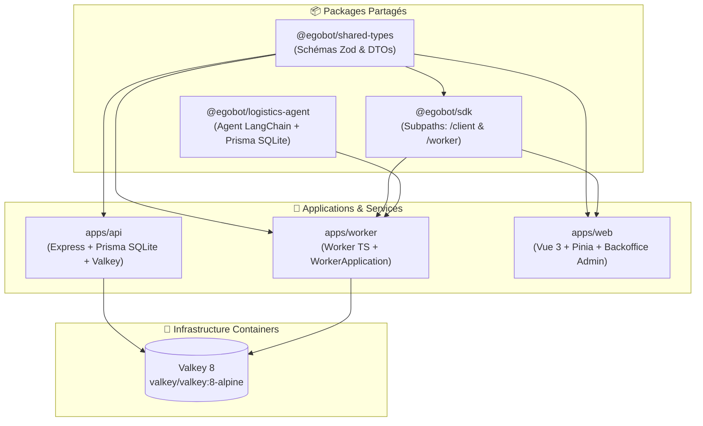

# 🚀 EgoBot Monorepo 100% TypeScript (`egobot`)

Scaffold d'architecture monorepo hautement modulaire et réutilisable **100% TypeScript**, articulé autour de `pnpm workspaces`, `Turborepo` et `Valkey 8` (conçu pour l'orchestration d'agents réactifs, d'inférence LLM et de plateformes SaaS).

---

## 🏗️ Vue d'Ensemble de l'Architecture Monorepo



> ⚠️ `docker-compose.dev.yml`/`docker-compose.prod.yml` provisionnent encore un
> conteneur PostgreSQL pour `logistics-agent` (`DATABASE_URL=postgresql://...`
> passé au `worker`) — cette bascule vers SQLite (fichier local) n'a pas
> encore été répercutée dans les fichiers Docker Compose. À vérifier avec
> l'équipe avant de lancer le worker en conteneur sur cette branche.

---

## 📂 Navigation & Documentation des Projets

| Projet / Package | Rôle & Composants | Lien vers la Documentation |
| :--- | :--- | :--- |
| 📦 **`packages/shared-types`** | Contrats Zod & DTOs universels (`User`, `Conversation`, `Job`, `SSE`). | 📄 [packages/shared-types/README.md](packages/shared-types/README.md) |
| 📦 **`packages/sdk`** | SDK universel (`/client` pour Web REST/SSE & `/worker` pour Worker TS). | 📄 [packages/sdk/README.md](packages/sdk/README.md) |
| 📦 **`packages/logistics-agent`** | Agent LangChain de suivi logistique (commandes, livraisons, stock) + Prisma SQLite. | 📄 [packages/logistics-agent/README.md](packages/logistics-agent/README.md) |
| ⚡ **`apps/api`** | Backend Express, BDD Prisma SQLite WAL, EventBus & Valkey Streams. | 📄 [apps/api/README.md](apps/api/README.md) |
| ⚙️ **`apps/worker`** | Worker d'inférence en Pure TypeScript (`WorkerApplication`), modèles `CHATBOT` et `LOGISTICS`. | 📄 [apps/worker/README.md](apps/worker/README.md) |
| 💻 **`apps/web`** | Interface Web Vue 3 + Chat Store Pinia + Backoffice. | 📄 [apps/web/README.md](apps/web/README.md) |

---

## ⚙️ Comment Fonctionne ce Monorepo ?

Le monorepo repose sur le duo **`pnpm workspaces`** (pour la gestion des paquets et le linking local) et **`Turborepo`** (pour l'orchestration des tâches et le cache intelligent).

### 1. Linking Local & Symlinks (`workspace:*`)
Le fichier `pnpm-workspace.yaml` déclare l'ensemble des projets du workspace (`apps/*` et `packages/*`).
Lorsque `apps/worker` déclare `"@egobot/shared-types": "workspace:*"` dans son `package.json`, `pnpm` crée automatiquement un **lien symbolique local** vers le code compilé dans `packages/shared-types/dist`. Aucune publication sur un registre externe (NPM) n'est nécessaire.

### 2. Graphe de Dépendances & Cache (`turbo.json`)
Turborepo analyse le graphe de dépendances (*DAG - Directed Acyclic Graph*) pour exécuter les tâches dans le meilleur ordre possible :
- Lors de la commande `pnpm build`, Turborepo compile d'abord `shared-types`, `sdk` et `logistics-agent`, puis en parallèle `api`, `worker` et `web`.
- **Cache Hit** : Si le code source d'un package n'a pas changé, Turborepo réutilise instantanément les artefacts du cache sans re-compiler (`cache hit`).

---

## ⚠️ Windows : l'API doit tourner en Docker

`apps/api` utilise **`@valkey/valkey-glide`** comme client Redis/Valkey, dont les binaires natifs ne sont publiés **que pour macOS et Linux** — il n'existe aucun paquet `@valkey/valkey-glide-win32-*`. Lancer `pnpm --filter api dev` nativement sous Windows échoue donc systématiquement (`Cannot find module '@valkey/valkey-glide-win32-x64-msvc'`).

- **Sous Windows** : utiliser **Docker** pour `apps/api` (voir plus bas). `apps/worker` et `apps/web` n'ont pas cette contrainte (ils reposent sur `ioredis`, portable) et peuvent tourner nativement si besoin.
- **Sous macOS / Linux** : le mode natif (`pnpm dev`) fonctionne sans Docker pour les trois applications.

---

## ⚡ Guide de Démarrage Rapide (Docker — recommandé, fonctionne sur toutes plateformes)

### 1. Copier les fichiers d'environnement

```bash
# apps/api : requis, sinon l'app se croit en production et refuse de démarrer
cp apps/api/.env.example apps/api/.env
```
Éditer `apps/api/.env` si besoin (`CORS_ORIGIN` doit correspondre au port du frontend — `http://localhost:3000` par défaut avec `apps/web/vite.config.ts`).

### 2. Installer les dépendances

```bash
pnpm install
```

### 3. Démarrer la stack complète en développement (hot-reload)

```bash
docker compose -f docker-compose.dev.yml up -d --build
```
Démarre `valkey`, `postgres`, `api` (`http://localhost:8000`), `worker` et `web` (`http://localhost:3000`).

Pour ne démarrer qu'un sous-ensemble (ex. juste l'API pour tester l'auth) :
```bash
docker compose -f docker-compose.dev.yml up -d --build valkey api
```

### 4. Appliquer les migrations base de données

Deux bases SQLite distinctes à migrer séparément (chacune un simple fichier local, aucun serveur requis) :

```bash
# apps/api : utilisateurs, conversations, jobs
pnpm db:migrate

# packages/logistics-agent : clients, commandes, livraisons, stock
cd packages/logistics-agent
pnpm exec prisma migrate dev
cd ../..
```
*(`packages/logistics-agent/.env` doit exister — copier `.env.example` au préalable ; la valeur par défaut `DATABASE_URL="file:./logistics.db"` convient telle quelle en local.)*

### 5. Peupler la base logistique avec des données de test (optionnel)

```bash
cd packages/logistics-agent
pnpm exec prisma db seed
cd ../..
```
*(~50 clients, 150 commandes et leurs livraisons/mouvements de stock, jeu de données déterministe et auto-vérifié. `apps/api` n'a pas de script de seed configuré à ce jour.)*

### 6. Suivre les logs

```bash
docker compose -f docker-compose.dev.yml logs -f api worker web
```

### 7. Tout arrêter proprement

```bash
docker compose -f docker-compose.dev.yml down
```
*(Les fichiers SQLite persistent sur le disque hôte, indépendamment de Docker ; Valkey n'a pas de volume et repart vide à chaque `down` — les sessions/config utilisateur en cache y sont perdues.)*

---

## ⚡ Guide de Démarrage Rapide (natif, macOS / Linux uniquement)

```bash
# 1. Démarrer uniquement l'infrastructure (Valkey)
docker compose -f docker-compose.dev.yml up -d valkey

# 2. Migrations (voir commandes détaillées ci-dessus)
pnpm db:migrate
cd packages/logistics-agent && pnpm exec prisma migrate dev && cd ../..

# 3. Lancer l'ensemble des applications en mode développement
pnpm dev
```
*Turborepo lance simultanément l'API Express sur `http://localhost:8000`, le Worker TS et le Client Web Vue 3 sur `http://localhost:3000`.*

### Compiler l'intégralité du Monorepo
```bash
pnpm build
```

---

## 🔄 Comment Mettre à Jour les Dépendances du Monorepo ?

### 1. Mettre à jour de manière interactive TOUT le Monorepo
```bash
pnpm update -r --interactive --latest
```
*(Le drapeau `-r` ou `--recursive` applique la commande sur l'ensemble des workspaces).*

### 2. Mettre à jour les dépendances d'un projet spécifique
```bash
# Mettre à jour une dépendance spécifique dans l'API (nom de package non scopé : "api")
pnpm --filter api update express@latest

# Ajouter ou mettre à jour un paquet dans shared-types
pnpm --filter @egobot/shared-types add zod@latest
```

### 3. Mettre à jour les dépendances de la Racine (Turbo, TypeScript)
```bash
pnpm add -Dw turbo@latest typescript@latest
```
*(Le drapeau `-w` ou `--workspace-root` cible spécifiquement la racine).*

---

## 📦 Build de Production, Tests & Releases

### 1. Compiler l'ensemble du Monorepo pour la Production
```bash
pnpm build
```
*Turborepo orchestre la compilation de `shared-types`, `sdk`, `logistics-agent`, puis génère les bundles dans `apps/api/dist`, `apps/worker/dist` et `apps/web/dist`.*

Pour compiler uniquement une application spécifique :
```bash
pnpm --filter @egobot/web build
pnpm --filter api build
```

### 2. Lancer les tests

`pnpm test` à la racine ne couvre que `packages/*` (Vitest) — `apps/api`, `apps/worker` et `apps/web` ont chacun leur propre runner et doivent être lancés individuellement :

```bash
# packages/* uniquement (Vitest, à la racine)
pnpm test

# Chaque application/package individuellement
pnpm --filter api test                    # Vitest
pnpm --filter @egobot/worker test         # node:test
pnpm --filter @egobot/web test            # Vitest
pnpm --filter @egobot/sdk test            # Vitest
pnpm --filter @egobot/shared-types test   # Vitest
pnpm --filter @egobot/logistics-agent test # Vitest
```

### 3. Vérification des types & lint
```bash
pnpm --filter api check-types
pnpm lint
```

---

## 🐳 Containerisation Docker par Projet & Environnement

Chaque application dispose de trois Dockerfiles (`dev`, `test`, `prod`), et le monorepo fournit un fichier Docker Compose par environnement.

### A. Fichiers Docker par Projet
* **`apps/api/`** :
  - `Dockerfile.dev` : Hot-reload avec `tsx watch` (Node 22-alpine).
  - `Dockerfile.test` : Exécution automatique des tests Vitest API.
  - `Dockerfile.prod` : Image multi-stage issue de `pnpm deploy`.
* **`apps/worker/`** :
  - `Dockerfile.dev` : `tsx watch`, build préalable des dépendances workspace (`@egobot/logistics-agent`, `@egobot/sdk`, `@egobot/shared-types`) via `turbo build --filter=@egobot/worker^...`.
  - `Dockerfile.prod` : Image multi-stage + cible optionnelle `migrator` (applique les migrations PostgreSQL de `logistics-agent` avant démarrage).
* **`apps/web/`** :
  - `Dockerfile.dev` : Serveur de dev Vite (build préalable de `@egobot/sdk`).
  - `Dockerfile.test` : Exécution des tests unitaires Frontend.
  - `Dockerfile.prod` : Compilation statique Vue 3 + serveur Nginx Alpine.

### B. Commandes Docker Compose par Environnement
```bash
# 🛠️ 1. Stack complète en Développement (Hot-Reload)
docker compose -f docker-compose.dev.yml up -d --build

# 🧪 2. Suite de Tests automatisés en conteneur
docker compose -f docker-compose.test.yml up --build --exit-code-from api-test

# 🚀 3. Stack complète de Production
cp .env.example .env   # renseigner JWT_SECRET, POSTGRES_PASSWORD, OPENAI_API_KEY
docker compose -f docker-compose.prod.yml up -d --build
```
*(`docker-compose.prod.yml` refuse de démarrer si `JWT_SECRET`, `POSTGRES_PASSWORD` ou `OPENAI_API_KEY` sont absents — voir `.env.example` à la racine. Un conteneur éphémère `migrate` applique les migrations PostgreSQL avant que le `worker` ne démarre.)*

### C. Rebuilder un seul service après une modification de Dockerfile ou de dépendance
```bash
docker compose -f docker-compose.dev.yml up -d --build api
docker compose -f docker-compose.dev.yml up -d --build worker
docker compose -f docker-compose.dev.yml up -d --build web
```

---

## 🧭 Dépannage rapide

| Symptôme | Piste |
| :--- | :--- |
| `Cannot find module '@valkey/valkey-glide-win32-x64-msvc'` | Windows natif non supporté pour `apps/api` — passer par Docker (voir plus haut). |
| Le chatbot ne répond jamais (aucune erreur visible) | Vérifier que `worker` et `api` utilisent le même environnement normalisé (`dev`/`prod`) : `docker exec scaffold_valkey_dev valkey-cli KEYS "jobs:queue:*"` doit montrer des clés cohérentes des deux côtés. |
| `Error: The requested module '@prisma/client' does not provide an export named 'Status'` | Le client Prisma n'est pas généré : `pnpm --filter api exec prisma generate` (ou `pnpm --filter @egobot/logistics-agent exec prisma generate`). |
| `P3015: Could not find the migration file` | Un dossier de migration local est vide/orphelin (résidu non versionné) — le supprimer puis relancer `pnpm db:migrate`. |
| Erreur CORS au login/register alors que la config semble correcte | Vérifier d'abord que l'API répond du tout : `curl -i http://localhost:8000/api/v1/auth/me`. Un `(null)` côté navigateur signifie souvent que le serveur est injoignable, pas un vrai rejet CORS. |

---

## 🛡️ Licence
Projet sous licence MIT.
