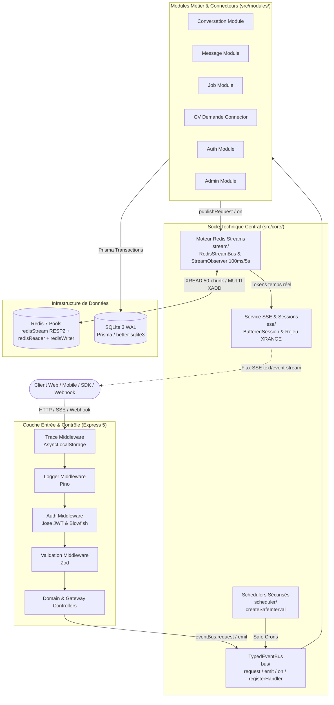

# 01. Architecture Globale du Framework

L'API AGELID est construite selon une architecture hybride **Domain-Driven Design (DDD)** et **Event-Driven Architecture (EDA)** conçue pour concilier très haute performance en streaming temps réel, découplage strict des domaines et résilience opérationnelle.

---

## 🏛️ Vue d'Ensemble des Couches

---

## 🗺️ Cartographie du Socle Technique (`src/core/`)

Le dossier `src/core/` regroupe les 5 briques fondatrices réutilisables par l'ensemble des modules :

| Répertoire                | Rôle & Responsabilité                                                                        | Composants Clés                                                                            |
| :------------------------ | :------------------------------------------------------------------------------------------- | :----------------------------------------------------------------------------------------- |
| **`src/core/bus/`**       | Bus d'événements typé en mémoire pour la communication inter-domaines.                       | `TypedEventBus`, `eventBus`, `defineCommand`, `defineEvent`                                |
| **`src/core/stream/`**    | Orchestration unifiée des flux Redis Streams, files de workers et observateur multi-niveaux. | `RedisStreamBus`, `StreamObserver`, `defineWorkerQueue`, `defineStreamEvent`, `StreamKeys` |
| **`src/core/sse/`**       | Gestion des flux HTTP Server-Sent Events, déduplication et bufferisation.                    | `SseService`, `BufferedSession`                                                            |
| **`src/core/scheduler/`** | Planification sécurisée de tâches d'arrière-plan sans chevauchement.                         | `createSafeInterval`, `SafeIntervalHandle`                                                 |
| **`src/core/errors/`**    | Hiérarchie d'erreurs HTTP standardisées.                                                     | `HttpError`, `BadRequestError`, `NotFoundError`, etc.                                      |

---

## 🔑 Les 5 Piliers Architecturaux

### 1. Event-Driven Architecture (EDA) & TypedEventBus

- Découplage complet des modules : aucun module n'importe directement les repositories d'un autre module.
- L'instance singleton `eventBus` expose strictement **4 méthodes** :
  - `registerHandler(command, handler)` : Enregistrement unique du gestionnaire d'une commande.
  - `request(command, input, timeoutMs?)` : Exécution synchrone (Request / Reply) avec validation Zod d'entrée et de sortie et timeout garanti.
  - `emit(event, payload)` : Diffusion asynchrone Fire & Forget validée.
  - `on(event, handler)` : Abonnement d'écouteurs avec propagation automatique de la trace.

### 2. Moteur Redis Streams & Streaming SSE Multi-Niveaux

- Les échanges asynchrones avec les workers sont fiabilisés par Redis Streams (`XADD`) avec un TTL de 12 heures.
- **`StreamObserver`** applique un **cadencement multi-niveaux** :
  - **Palier Fast (100 ms)** : Pour la réactivité instantanée des tokens SSE d'inférence.
  - **Palier Slow (5 000 ms)** : Pour les tâches longues ou workers externes asynchrones (ex: worker GV).
- **Chunking par lots de 50 clés** et lecture concurrente sur le pool dédié **`redisStream` (RESP2)**.
- **Reconnexion sans perte (_Zero-loss_)** : Tout client déconnecté rejoue l'historique complet via son en-tête HTTP `Last-Event-ID` et la commande Redis `XRANGE`.

### 3. Persistance SQLite en Mode WAL (Write-Ahead Logging)

- Base relationnelle locale ultra-rapide pilotée par Prisma et `better-sqlite3`.
- Configuration `PRAGMA journal_mode = WAL;` et `PRAGMA synchronous = NORMAL;` permettant des lectures concurrentes non bloquantes par les écritures.

### 4. Schedulers Sécurisés (`SafeInterval`)

- Bannissement total des `setInterval` natifs.
- Encapsulation des boucles de fond dans `createSafeInterval` pour garantir l'absence de chevauchement d'exécutions (_anti-overlapping_) et la capture de toute exception non gérée.

### 5. Traçabilité Contextuelle Distribuée (`AsyncLocalStorage`)

- Un `correlationId` unique est instancié à l'entrée de chaque requête via `trace.middleware.ts`.
- Stocké dans `traceStorage`, ce contexte est propagé automatiquement à travers l'EventBus, les écritures Redis Streams et systématiquement injecté dans tous les logs **Pino**.
