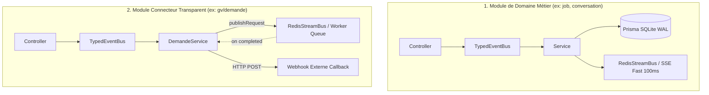

# 02. Anatomie d'un Module de Domaine

Dans le framework AGELID, chaque domaine métier ou connecteur est complètement auto-contenu dans son dossier sous `src/modules/<domaine>/`.

---

## 📁 Structure Standard en 8 Fichiers

Chaque module complet respecte l'anatomie standard suivante :

```
src/modules/<domaine>/
├── <Domaine>Controller.ts   # 1. Contrôleur HTTP / SSE (Express)
├── <Domaine>Service.ts      # 2. Logique métier & Orchestration (EventBus / StreamBus)
├── <Domaine>Repository.ts   # 3. Accès aux données (Prisma SQLite / Redis)
├── <Domaine>Scheduler.ts    # 4. (Optionnel) Crons & Tâches de fond récurrentes
├── <domaine>.schema.ts      # 5. Schémas de validation Zod & Types TypeScript
├── <domaine>.commands.ts    # 6. Définitions des commandes EventBus (Request / Reply)
├── <domaine>.events.ts      # 7. Définitions des événements EventBus (Fire & Forget)
├── <domaine>.streams.ts     # 8. (Optionnel) Contrats de files & flux Redis Streams
└── index.ts                 # Point d'entrée public et exports du module
```

---

## 🔬 Rôle Détaillé de Chaque Composant

### 1. `<Domaine>Controller.ts`

- **Rôle** : Reçoit les requêtes HTTP, extrait les données validées via `getValidatedData(req)`, délègue le traitement à l'EventBus (`eventBus.request(...)`) ou au Service, et formate les réponses avec `ApiResponseFactory`.
- **Règle** : **Aucune logique métier ni requête SQL directe dans le contrôleur**.

```typescript
import type { Request, Response } from "express";
import { eventBus } from "../../core/bus";
import { ConversationCommands } from "./conversation.commands";
import { ApiResponseFactory } from "../../utils";

export class ConversationController {
	public async getConversations(req: Request, res: Response): Promise<void> {
		const user = req.user!;
		const result = await eventBus.request(ConversationCommands.list, {
			userId: user.id,
			clientId: user.client_id,
		});
		ApiResponseFactory.success(res, result);
	}
}
```

---

### 2. `<Domaine>Service.ts`

- **Rôle** : Cœur d'orchestration métier. Il initialise les gestionnaires de commandes du bus en mémoire (`eventBus.registerHandler`), écoute les événements (`eventBus.on`) et interagit avec les flux Redis (`redisStreamBus.publishRequest`, `redisStreamBus.on`).
- **Règle** : Doit exposer une méthode statique idempotente `init()`.

```typescript
import { eventBus } from "../../core/bus";
import { redisStreamBus } from "../../core/stream";
import { ConversationCommands } from "./conversation.commands";
import { ConversationRepository } from "./ConversationRepository";

export class ConversationService {
	private static initialized = false;

	public static init(): void {
		if (this.initialized) return;
		this.initialized = true;

		// 1. Enregistrement d'une commande métier
		eventBus.registerHandler(ConversationCommands.list, async (input) => {
			return ConversationRepository.findMany(input.userId, input.clientId);
		});
	}
}
```

---

### 3. `<Domaine>Repository.ts`

- **Rôle** : Isole l'accès aux données persistantes (Prisma SQLite WAL ou Redis).
- **Règle** : Ne contient aucune logique métier (pas de calculs tarifaires, pas de redirection).

```typescript
import { prisma } from "../../config/database";

export class ConversationRepository {
	public static async findMany(userId: string, clientId: string) {
		return prisma.conversation.findMany({
			where: { user_id: userId, client_id: clientId, deleted_at: null },
			orderBy: { updated_at: "desc" },
		});
	}
}
```

---

### 4. `<Domaine>Scheduler.ts`

- **Rôle** : Planifie les tâches récurrentes de nettoyage ou de synchronisation avec `createSafeInterval`.
- **Règle** : Doit exposer `start()` et `stop()` idempotents, et déclencher ses actions via l'EventBus.

```typescript
import { createSafeInterval, type SafeIntervalHandle } from "../../core/scheduler";
import { eventBus } from "../../core/bus";
import { ConversationCommands } from "./conversation.commands";

export class ConversationScheduler {
	private static task: SafeIntervalHandle | null = null;

	public static start(): void {
		if (this.task) return;
		this.task = createSafeInterval(
			async () => {
				await eventBus.request(ConversationCommands.cleanupStale, {});
			},
			{
				name: "Nettoyage conversations inactives",
				intervalMs: 3600 * 1000,
			},
		);
		this.task.start();
	}

	public static stop(): void {
		this.task?.stop();
		this.task = null;
	}
}
```

---

### 5. `<domaine>.schema.ts`

- **Rôle** : Centralise tous les schémas Zod de validation des requêtes HTTP, payloads de commandes et structures de données.

```typescript
import { z } from "zod";

export const CreateConversationInputSchema = z.object({
	title: z.string().min(1).max(100),
	model: z.enum(["CHATBOT", "STATISTIQUE", "OBJ_TRV_PERDU"]),
});

export type CreateConversationInput = z.infer<typeof CreateConversationInputSchema>;
```

---

### 6. `<domaine>.commands.ts`

- **Rôle** : Déclare les contrats de commandes synchrones (Request / Reply) pris en charge par le domaine via `defineCommand`.

```typescript
import { z } from "zod";
import { defineCommand } from "../../core/bus";

export const ConversationCommands = {
	list: defineCommand("conversation.list", z.object({ userId: z.string(), clientId: z.string() }), z.array(z.any())),
	cleanupStale: defineCommand("conversation.cleanup_stale", z.object({}), z.object({ deletedCount: z.number() })),
};
```

---

### 7. `<domaine>.events.ts`

- **Rôle** : Déclare les contrats d'événements asynchrones (Fire & Forget) diffusés lors d'une mutation d'état via `defineEvent`.

```typescript
import { z } from "zod";
import { defineEvent } from "../../core/bus";

export const ConversationEvents = {
	deleted: defineEvent(
		"conversation.deleted",
		z.object({
			conversationId: z.string(),
			userId: z.string(),
		}),
	),
};
```

---

### 8. `<domaine>.streams.ts`

- **Rôle** : Déclare les contrats de files de workers (`defineWorkerQueue`) et les événements de réponse Redis Streams (`defineStreamEvent`).

```typescript
import { z } from "zod";
import { defineStreamEvent, defineWorkerQueue } from "../../core/stream";

export const ConversationStreamEvents = {
	messageGenerated: defineStreamEvent(
		"conversation.message_generated",
		z.object({
			messageId: z.string(),
			content: z.string(),
		}),
	),
};

export const ConversationWorkerQueue = defineWorkerQueue({
	workerType: "CONVERSATION_PROCESSOR",
	pollIntervalMs: 1000,
	requestSchema: z.object({ conversationId: z.string() }),
	terminalEvents: [ConversationStreamEvents.messageGenerated.name],
	events: ConversationStreamEvents,
});
```

---

## 🏛️ Les 2 Archétypes de Modules



1. **Module Métier (ex: `conversation`, `job`)** :
   - Schémas stricts Zod.
   - Persistance relationnelle SQLite WAL via Prisma.
   - Diffusion de flux temps réel vers le client via `SseService`.

2. **Module Connecteur Transparent / Passthrough (ex: `gv/demande`)** :
   - Schémas permissifs (`z.any()` ou `.passthrough()`).
   - Aucune table locale : publication directe sur la file du worker (`jobs:queue:<env>:<workerType>`) avec cadencement éco (`5000ms`).
   - Réception de la réponse via `redisStreamBus.on()` et renvoi direct au **callback webhook**.

---

## 🚫 Règle d'Or : Interdiction des Imports Croisés de Repositories

```
❌ INTERDIT (Couplage fort entre domaines) :
Dans MessageService.ts :
import { ConversationRepository } from "../conversation/ConversationRepository";
const conv = await ConversationRepository.findById(convId);

✅ OBLIGATOIRE (Découplage événementiel) :
Dans MessageService.ts :
import { ConversationCommands } from "../conversation/conversation.commands";
const conv = await eventBus.request(ConversationCommands.getById, { id: convId });
```
