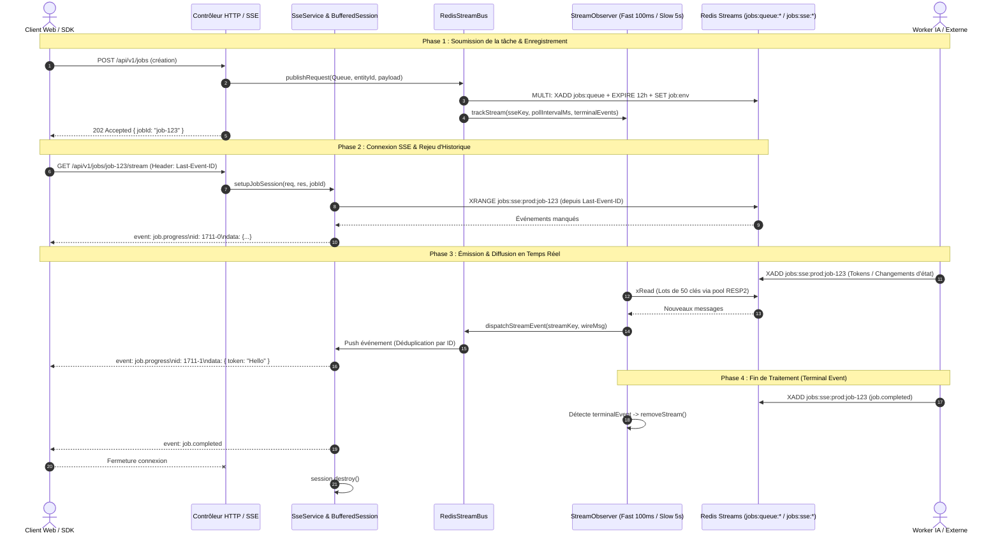

# 05. Streaming Temps Réel SSE & Socle Stream

Le backend AGELID intègre un socle unifié et haute performance pour le traitement des flux asynchrones et le streaming temps réel via **Server-Sent Events (SSE)**.

Ce système repose sur deux composants complémentaires :

- **Le socle Stream Redis (`src/core/stream/`)** : Gère la publication de tâches vers les workers, l'orchestration des flux Redis Streams de réponses, le cadencement adaptatif multi-niveaux et l'observabilité.
- **Le service SSE (`src/core/sse/`)** : Gère la session HTTP persistante, la bufferisation ordonnée, le rejeu d'historique et la déduplication pour le client web/mobile.

---

## 🌊 Architecture Globale du Streaming



---

## 🧩 Le Socle Technique `src/core/stream/`

Le dossier [`src/core/stream/`](file:///home/tboutin/Documents/AGELID/api/src/core/stream/) standardise l'accès aux flux Redis avec des contrats typés.

### 1. Définition des Contrats : `defineStreamEvent` & `defineWorkerQueue`

- `defineStreamEvent(name, payloadSchema)` : Déclare un événement de flux avec validation Zod (supporte les schémas stricts ou permissifs avec `z.any()`).
- `defineWorkerQueue(config)` : Déclare le contrat d'une file de requêtes pour un type de worker donné.

```typescript
import { z } from "zod";
import { defineStreamEvent, defineWorkerQueue } from "../../core/stream";

// Définition des événements de réponse
export const InferenceStreamEvents = {
	progress: defineStreamEvent(
		"job.progress",
		z.object({
			chunk: z.string(),
			tokensCount: z.number().optional(),
		}),
	),
	completed: defineStreamEvent(
		"job.completed",
		z.object({
			status: z.literal("COMPLETED"),
			output: z.string(),
		}),
	),
	failed: defineStreamEvent(
		"job.failed",
		z.object({
			status: z.literal("FAILED"),
			error: z.string(),
		}),
	),
};

// Définition de la file de requêtes vers le worker
export const InferenceWorkerQueue = defineWorkerQueue({
	workerType: "LLM_INFERENCE",
	pollIntervalMs: 100, // Cadencement ultra-rapide (tier "fast" pour SSE interactif)
	requestSchema: z.object({
		prompt: z.string().min(1),
		temperature: z.number().default(0.7),
	}),
	terminalEvents: [InferenceStreamEvents.completed.name, InferenceStreamEvents.failed.name],
	events: InferenceStreamEvents,
});
```

---

### 2. Le Bus de Flux Redis : `RedisStreamBus`

`RedisStreamBus` ([`src/core/stream/RedisStreamBus.ts`](file:///home/tboutin/Documents/AGELID/api/src/core/stream/RedisStreamBus.ts)) fournit une interface de haut niveau :

#### Méthodes Principales :

- **`publishRequest(queue, entityId, payload, options?)`** :
  1. Valide le payload avec le schéma `queue.requestSchema`.
  2. Exécute une transaction atomique Redis (`MULTI`) : `XADD` dans `jobs:queue:<env>:<workerType>` + `EXPIRE 43200` (TTL 12h) + `SET job:env:<entityId>` (TTL 12h).
  3. Enregistre automatiquement le flux de réponse `jobs:sse:<env>:<entityId>` auprès du `StreamObserver`.
  4. Récupère le `correlationId` depuis `traceStorage` pour l'injecter dans le message.
- **`publishToResponse(event, entityId, payload, options?)`** : Écrit un événement intermédiaire ou final sur `jobs:sse:<env>:<entityId>` avec TTL de 12 heures.
- **`on(event, handler)`** : Abonne un écouteur typé à un événement de réponse.
- **`isTracking(entityId, env?)`** : Vérifie si un flux est actuellement surveillé par l'observateur.
- **`start()` / `stop()`** : Démarre ou arrête le moteur de streaming sous-jacent.

```typescript
import { redisStreamBus } from "../../core/stream";
import { InferenceWorkerQueue, InferenceStreamEvents } from "./inference.streams";

// 1. Publier une demande de génération
await redisStreamBus.publishRequest(
	InferenceWorkerQueue,
	"job-9988",
	{ prompt: "Résumez ce rapport.", temperature: 0.5 },
	{ timeoutMs: 120_000 },
);

// 2. Écouter la progression en temps réel
redisStreamBus.on(InferenceStreamEvents.progress, async ({ entityId, payload, rawMessageId }) => {
	console.log(`Job ${entityId} progress:`, payload.chunk);
});
```

---

### 3. L'Observateur Multi-Niveaux : `StreamObserver`

`StreamObserver` ([`src/core/stream/StreamObserver.ts`](file:///home/tboutin/Documents/AGELID/api/src/core/stream/StreamObserver.ts)) surveille activement tous les flux de réponses Redis enregistrés.

#### Caractéristiques Architecturales Clés :

1. **Cadencement Multi-Niveaux (_Tiered Polling_)** :
   - **Palier Fast (100 ms)** : Pour les flux interactifs nécessitant une latence minimale (ex: tokens SSE IA).
   - **Palier Slow (5 000 ms)** : Pour les tâches longues ou les workers lourds asynchrones (ex: worker GV).
2. **Chunking par Lots de 50 Clés** :
   - Les clés surveillées sont regroupées en blocs de 50 clés maximum (`CHUNK_SIZE = 50`).
   - Chaque bloc fait l'objet d'une commande unique `xRead` exécutée en parallèle via `Promise.all` sur le pool de connexions dédié **`redisStream` (RESP2)**.
3. **Résilience Anti-Poison-Pill** :
   - Si un message est malformé ou que le handler déclenche une exception, le bloc `finally` fait avancer le curseur de lecture (`info.lastId = rawMessageId`). Ainsi, **aucun message corrompu ne peut bloquer la file indéfiniment**.
4. **Purge Automatique Anti-Fuite Mémoire (_Auto-Pruning_)** :
   - Une boucle de nettoyage s'exécute toutes les 30 secondes pour évincer les flux inactifs ou ayant dépassé leur `timeoutMs` (seuil par défaut de 2 heures).
5. **Détection d'Événements Terminaux** :
   - Dès qu'un message correspondant à l'un des `terminalEvents` configurés est reçu, le flux est automatiquement désinscrit de la surveillance.

---

## 🏛️ Les 2 Archétypes d'Intégration

Le framework distingue deux archétypes d'implémentation selon le besoin métier :

### 🌟 Archétype 1 : Mode Connecteur Transparent (Passthrough)

- **Cas d'usage** : Passerelle vers un worker externe ou microservice tiers (ex: module [`src/modules/gv/demande`](file:///home/tboutin/Documents/AGELID/api/src/modules/gv/demande/)).
- **Caractéristiques** :
  - Schémas souples avec `z.any()` ou `.passthrough()` pour transférer le JSON sans altération.
  - Cadencement économe (`pollIntervalMs: 5000`).
  - Aucun stockage en base locale : réception de la réponse terminale et transmission directe à un **webhook callback HTTP**.

```typescript
// demande.streams.ts (Exemple Connecteur Transparent)
export const DemandeStreamEvents = {
	completed: defineStreamEvent("demande.completed", z.any()),
	failed: defineStreamEvent("demande.failed", z.object({ error: z.string().optional() }).passthrough()),
};

export const DemandeWorkerQueue = defineWorkerQueue({
	workerType: "GV",
	pollIntervalMs: 5000,
	requestSchema: DemandeSchema,
	terminalEvents: [DemandeStreamEvents.completed.name, DemandeStreamEvents.failed.name],
	events: DemandeStreamEvents,
});
```

---

### 🏛️ Archétype 2 : Mode Domaine Métier

- **Cas d'usage** : Tâches applicatives cœur nécessitant traçabilité, streaming utilisateur et persistance (ex: module [`src/modules/job`](file:///home/tboutin/Documents/AGELID/api/src/modules/job/)).
- **Caractéristiques** :
  - Schémas Zod stricts pour chaque étape de cycle de vie.
  - Cadencement rapide (Fast tier 100 ms).
  - Persistance de l'état en base relationnelle SQLite (WAL) via Prisma.
  - Diffusion des tokens en direct via le service SSE (`SseService`).

---

## 🖥️ Intégration Côté Contrôleur HTTP / SSE

Pour exposer un flux SSE à destination du client web :

```typescript
import type { Request, Response } from "express";
import { SseService } from "../../core/sse";

export class InferenceController {
	public async subscribeStream(req: Request, res: Response): Promise<void> {
		const { entityId } = req.params;

		// 1. Initialise la session HTTP SSE (Content-Type: text/event-stream, no-cache)
		const session = await SseService.setupJobSession(req, res, entityId);

		// 2. Branche la session et synchronise l'historique depuis Redis Streams
		const env = req.user?.dev === "true" ? "dev" : "prod";
		const lastEventId = (req.headers["last-event-id"] || req.query.lastEventId) as string | undefined;

		await SseService.attachJobSession(entityId, session, env, lastEventId);
	}
}
```

---

## 🛡️ Fonctionnalités Clés du Moteur `SseService`

1. **Déduplication Robuste des Messages** :  
   `BufferedSession` compare les identifiants lexicographiques des messages Redis (`timestamp-sequence`). Tout message déjà transmis au client lors d'un rejeu est ignoré.
2. **Flush Immédiat** :  
   Appelle systématiquement `res.flush()` pour désactiver le buffering des reverse-proxies (Nginx, Traefik).
3. **Nettoyage Automatique à la Déconnexion** :  
   Dès rupture du socket TCP (`req.on("close")`), la session est détruite et désinscrite du registre en mémoire.
