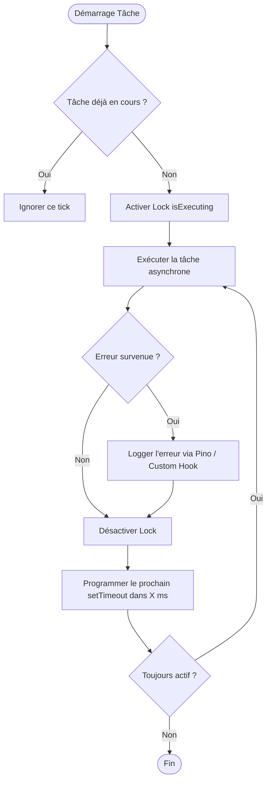

# 06. Schedulers & Tâches d'Arrière-Plan Sécurisées

Les tâches périodiques (crons) gèrent les nettoyages, les vérifications de statut et les relances asynchrones via la fonction utilitaire `createSafeInterval` ([`src/core/scheduler/safeInterval.ts`](file:///home/tboutin/Documents/AGELID/api/src/core/scheduler/safeInterval.ts)).

---

## 🛑 Pourquoi `setInterval` Brut est Dangereux

Dans une architecture Node.js asynchrone, un `setInterval` classique présente deux failles critiques :

1. **Chevauchement (Overlapping)** : Si un cycle prend plus de temps que l'intervalle (ex: transaction SQLite bloquée pendant 15s alors que l'intervalle est de 10s), plusieurs exécutions concurrentes vont s'empiler et saturer la mémoire et le pool de connexions.
2. **Crash Processus** : Si une promesse non gérée échoue dans le callback, l'ensemble du processus Node.js crashe (`UnhandledPromiseRejection`).

---

## 🛡️ Le Fonctionnement de `createSafeInterval`

`createSafeInterval` garantit :

1. **Lock Mutex Anti-Chevauchement** : Une tâche ne démarre jamais tant que l'exécution précédente n'est pas terminée.
2. **Replanification Dynamique (`setTimeout` récursif)** : L'intervalle de pause débute **après** la fin de l'exécution précédente.
3. **Protection Intégrale contre les Crashes** : Toutes les erreurs sont automatiquement interceptées et tracées via Pino sans interrompre les cycles futurs.



---

## 🛠️ Comment Intégrer un Scheduler dans votre Module

### 1. Structure de la Classe Scheduler

Créez `<Domaine>Scheduler.ts` dans votre module :

```typescript
import { createSafeInterval, type SafeIntervalHandle } from "../../core/scheduler/safeInterval";
import { eventBus } from "../../core/bus/eventBus";
import { WorkerCommands } from "./worker.commands";
import { LoggerFactory } from "../../config/logger";

const logger = LoggerFactory.getLogger("WorkerScheduler");

export class WorkerScheduler {
	private static task: SafeIntervalHandle | null = null;

	// ============================================================================
	/**
	 * Démarre la tâche périodique (Idempotent).
	 */
	// ============================================================================
	public static start(): void {
		if (this.task) return;

		this.task = createSafeInterval(
			async () => {
				// Déclenche la logique métier via l'EventBus
				await eventBus.request(WorkerCommands.computeStatus, {});
			},
			{
				name: "Vérification présence workers",
				intervalMs: 5000, // Toutes les 5 secondes
				runImmediately: true, // Exécution immédiate dès le boot
				onError: (err) => {
					logger.error("Erreur personnalisée dans le cron worker", err);
				},
			},
		);

		this.task.start();
		logger.info("WorkerScheduler démarré.");
	}

	// ============================================================================
	/**
	 * Arrête la tâche périodique lors du shutdown.
	 */
	// ============================================================================
	public static stop(): void {
		if (this.task) {
			this.task.stop();
			this.task = null;
			logger.info("WorkerScheduler arrêté.");
		}
	}
}
```

---

### 2. Démarrage et Arrêt dans l'Application

Dans [`src/index.ts`](file:///home/tboutin/Documents/AGELID/api/src/index.ts) :

```typescript
// 1. Au démarrage
WorkerScheduler.start();
JobScheduler.start();

// 2. Lors de l'arrêt gracieux (SIGINT / SIGTERM)
async function gracefulShutdown() {
	WorkerScheduler.stop();
	JobScheduler.stop();
	await prisma.$disconnect();
	process.exit(0);
}

process.on("SIGTERM", gracefulShutdown);
process.on("SIGINT", gracefulShutdown);
```
