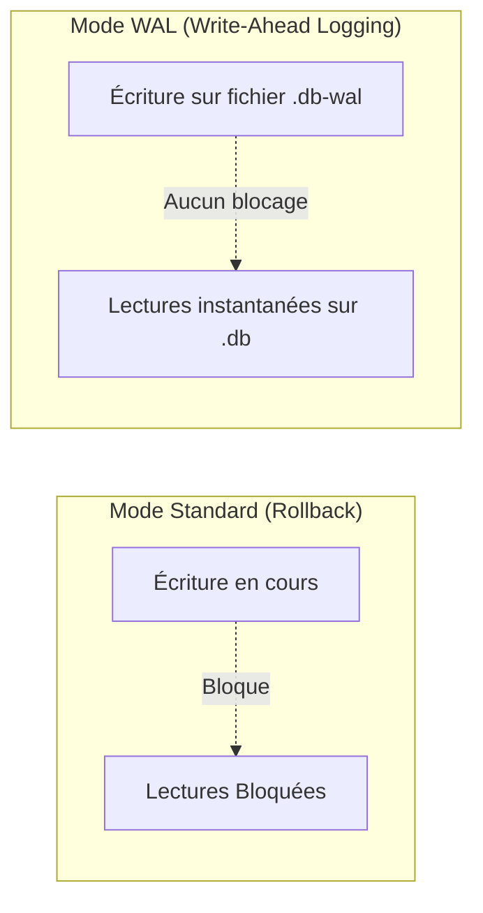

# 07. Base de Données SQLite & Mode WAL

L'API AGELID utilise **SQLite 3** via le pilote natif C++ **`better-sqlite3`** et l'adaptateur ORM **Prisma 7** ([`src/config/db.ts`](file:///home/tboutin/Documents/AGELID/api/src/config/db.ts)).

---

## ⚡ Pourquoi SQLite & Mode WAL ?

Par défaut, SQLite utilise un mode de journalisation _Rollback Journal_ qui verrouille l'intégralité du fichier de base de données à chaque écriture, bloquant ainsi toutes les lectures concurrentes.

Le framework configure automatiquement au démarrage deux directives **PRAGMA** fondamentales :

```sql
PRAGMA journal_mode = WAL;
PRAGMA synchronous = NORMAL;
```



### 1. `PRAGMA journal_mode = WAL` (Write-Ahead Logging)

- **Lectures concurrentes sans blocage** : Les lectures s'effectuent directement sur le fichier principal `.db`, tandis que les écritures sont ajoutées en append-only dans le journal `.db-wal`.
- **Gain de débit** : Les requêtes `SELECT` ne sont jamais ralenties par les requêtes d'insertion ou de mise à jour des messages et jobs.

### 2. `PRAGMA synchronous = NORMAL`

- En mode WAL, la synchronisation `NORMAL` garantit la cohérence des données tout en éliminant la plupart des appels système `fsync` bloquants, multipliant les performances d'écriture par un facteur 3 à 5.

---

## ⚠️ La Règle du "Single-Writer Lock"

> [!IMPORTANT]
> Même en mode WAL, SQLite ne possède qu'**un seul pointeur d'écriture à la fois**. Si deux transactions d'écriture tentent d'écrire en même temps, la seconde doit attendre que la première se termine sous peine d'erreur `SQLITE_BUSY`.

### 🛡️ Bonnes Pratiques Obligatoires pour les Développeurs :

1. **Transactions ultra-courtes (< 5ms)** : N'exécutez **jamais** d'appels réseau (HTTP, Redis, chiffrement lourd) à l'intérieur d'un bloc `prisma.$transaction(async (tx) => { ... })`.
2. **Pré-calculer avant d'écrire** : Préparez les UUIDs (`crypto.randomUUID()`), le chiffrement et les validations Zod **avant** d'ouvrir la transaction Prisma.
3. **Indexation ciblée** : Tout champ utilisé dans un `where` fréquent (ex: `user_id` dans `Conversation`) doit être indexé dans [`prisma/schema.prisma`](file:///home/tboutin/Documents/AGELID/api/prisma/schema.prisma) :
   ```prisma
   @@index([user_id])
   ```

---

## 🛠️ Synchronisation & Migrations Prisma

Dans le framework, les tables et schémas sont déclarés dans [`prisma/schema.prisma`](file:///home/tboutin/Documents/AGELID/api/prisma/schema.prisma).

### Commandes Utiles :

- **Synchroniser le schéma avec SQLite** :

  ```bash
  pnpm prisma:push
  ```

  _(Aligne instantanément la base SQLite `dev.db` ou `prod.db` avec votre schéma Prisma sans détruire les données existantes)._

- **Régénérer le client TypeScript Prisma** :

  ```bash
  pnpm prisma:generate
  ```

- **Ouvrir l'interface graphique de gestion des données (Prisma Studio)** :
  ```bash
  pnpm prisma:studio
  ```

---

## 🔌 Initialisation dans le Code (`src/config/db.ts`)

```typescript
import { PrismaClient } from "@prisma/client";
import { PrismaBetterSqlite3 } from "@prisma/adapter-better-sqlite3";
import { LoggerFactory } from "./logger";

const logger = LoggerFactory.getLogger("Prisma");
const connectionString = env.DATABASE_URL.replace(/^file:/, "");

// 1. Initialisation de l'adaptateur haute performance Prisma 7 avec better-sqlite3
const adapter = new PrismaBetterSqlite3({ url: connectionString });
export const prisma = new PrismaClient({ adapter });

// 2. Configuration des 5 directives PRAGMA de performance et concurrence au démarrage
export async function initializeDatabasePragmas(): Promise<void> {
	try {
		await prisma.$executeRawUnsafe("PRAGMA journal_mode=WAL;");
		await prisma.$executeRawUnsafe("PRAGMA synchronous=NORMAL;");
		await prisma.$executeRawUnsafe("PRAGMA cache_size=5000;");
		await prisma.$executeRawUnsafe("PRAGMA temp_store=MEMORY;");
		await prisma.$executeRawUnsafe("PRAGMA automatic_index=ON;");
		logger.info("SQLite configuré avec succès en mode WAL et synchronous=NORMAL");
	} catch (err) {
		logger.error("Erreur lors de la configuration des PRAGMAs SQLite", err);
	}
}
```

> [!NOTE]
> En cas d'indisponibilité de la base de données (flag `PRISMA_DISABLED=true` lors de certains tests isolés), un proxy de sécurité `createUnavailablePrismaProxy` intercepte les accès pour fournir des messages explicites sans bloquer le démarrage.
