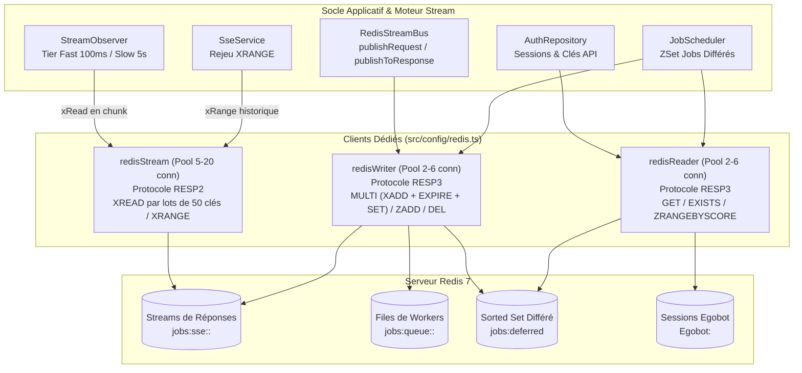

# 08. Infrastructure des Pools Redis & Moteur Stream

L'API AGELID s'appuie sur **Redis 7** comme colonne vertébrale pour la distribution des requêtes aux workers, le streaming temps réel SSE, la gestion des tâches différées et le stockage des sessions ([`src/config/redis.ts`](file:///home/tboutin/Documents/AGELID/api/src/config/redis.ts)).

---

## 🏛️ L'Architecture des 3 Pools Dédiés

Pour éviter que des lectures continues de flux (polling SSE ou workers) ne saturent les connexions requises pour l'authentification ou l'écriture des tâches, l'infrastructure sépare strictement les flux sur **3 pools de connexions isolés** :



---

## 📊 Rôle et Caractéristiques de Chaque Pool

### 1. `redisStream` (Pool de 5 à 20 connexions)

- **Protocole** : `RESP2` (performances maximales et faible empreinte mémoire sur les flux de données brutes).
- **Consommateurs** : [`StreamObserver`](file:///home/tboutin/Documents/AGELID/api/src/core/stream/StreamObserver.ts) et [`SseService`](file:///home/tboutin/Documents/AGELID/api/src/core/sse/sse.service.ts).
- **Opérations** :
  - `xRead` : Lecture concurrente et continue par lots de flux de réponses.
  - `xRange` : Rejeu instantané de l'historique lors d'une reconnexion client avec en-tête `Last-Event-ID`.
- **Mécanisme de Chunking** :  
  `StreamObserver` découpe l'ensemble des flux surveillés en **lots de 50 clés maximum** (`CHUNK_SIZE = 50`), exécutés en parallèle via `Promise.all` sur ce pool.
- **Résilience Anti-Poison-Pill** :  
  Si le parsing d'un message échoue ou déclenche une erreur, le bloc `finally` de l'observateur met systématiquement à jour `lastId = rawMessageId`, évitant qu'un message invalide ne bloque la file en boucle.

---

### 2. `redisReader` (Pool de 2 à 6 connexions)

- **Protocole** : `RESP3` (support complet des types de données avancés).
- **Consommateurs** : `AuthRepository`, `JobStreamHandler`, contrôleurs.
- **Opérations** : Lectures ponctuelles et non-bloquantes :
  - `get("Egobot:<userId>")` : Vérification des sessions et configurations utilisateur.
  - `exists("job:cancel:<jobId>")` : Contrôle des signaux d'annulation de tâches.
  - `zRangeByScore("jobs:deferred", 0, now)` : Récupération des tâches différées échues.

---

### 3. `redisWriter` (Pool de 2 à 6 connexions)

- **Protocole** : `RESP3`.
- **Consommateurs** : `RedisStreamBus`, `JobStreamHandler`, `AuthRepository`.
- **Opérations** : Écritures, suppressions et transactions atomiques :
  - **`publishRequest()`** : Exécute une transaction atomique via `redisWriter.multi()` :
    ```typescript
    await redisWriter
    	.multi()
    	.xAdd(queueKey, "*", messagePayload)
    	.expire(queueKey, 43_200) // TTL de sécurité 12h
    	.set(jobEnvKey, env, { EX: 43_200 })
    	.exec();
    ```
  - **`publishToResponse()`** : Écrit un token ou statut dans `jobs:sse:<env>:<entityId>` avec un TTL de 12 heures.
  - `zAdd("jobs:deferred", { score, value })` : Planification temporelle dans le Sorted Set.
  - `set("job:cancel:<entityId>", "1", { EX: 3600 })` : Signal d'annulation actif 1 heure.

---

## 🔑 Fabrique Centralisée des Clés : `StreamKeys`

Toutes les clés Redis sont générées via le singleton [`StreamKeys`](file:///home/tboutin/Documents/AGELID/api/src/core/stream/streamKeys.ts) :

```typescript
export const StreamKeys = {
	/** File de requêtes d'un worker : jobs:queue:<env>:<workerType> */
	queue: (env: string, workerType: string) => `jobs:queue:${env}:${workerType}`,

	/** Flux de réponse / tokens SSE : jobs:sse:<env>:<entityId> */
	sse: (env: string, entityId: string) => `jobs:sse:${env}:${entityId}`,

	/** Environnement temporaire d'une entité (TTL 12h) : job:env:<entityId> */
	jobEnv: (entityId: string) => `job:env:${entityId}`,

	/** Signal d'annulation temporaire (TTL 1h) : job:cancel:<entityId> */
	cancel: (entityId: string) => `job:cancel:${entityId}`,
};
```

---

## 🔄 Reconnexion Intelligente avec Exponential Backoff & Jitter

Pour se prémunir du phénomène de _Thundering Herd_ (tempête de reconnexions simultanées lors du redémarrage du serveur Redis), la fonction `reconnectStrategy` applique un délai exponentiel borné avec **jitter aléatoire** :

```typescript
export function reconnectStrategy(retries: number): number {
	// Base exponentielle bornée à 2 000 ms max
	const base = Math.min(retries * 100, 2000);
	// Jitter aléatoire entre 0 et 200 ms
	const jitter = Math.random() * 200;
	return base + jitter;
}
```

---

## 🔍 Proxy de Journalisation et Traçabilité (`wrapWithLogging`)

Tous les clients de pools (`rawStream`, `rawReader`, `rawWriter`) sont encapsulés de façon transparente par un **Proxy ES6** :

1. Intercepte l'appel de chaque méthode (`xAdd`, `get`, `multi`, `zAdd`).
2. Récupère automatiquement le contexte de corrélation (`correlationId`) via `traceStorage.getStore()`.
3. Propage le contexte de trace sans nécessiter de modification manuelle du code applicatif.
