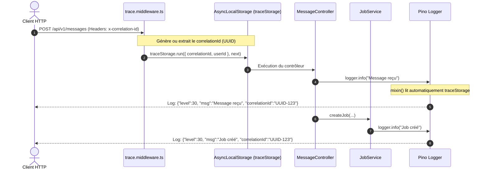

# 09. Système de Logs & Traçabilité Distribuée

L'API AGELID implémente un système de journalisation structurée ultra-rapide basé sur **Pino** et l'API native Node.js **`AsyncLocalStorage`** ([`src/config/logger.ts`](file:///home/tboutin/Documents/AGELID/api/src/config/logger.ts), [`src/config/trace.ts`](file:///home/tboutin/Documents/AGELID/api/src/config/trace.ts)).

---

## 🎯 Les Objectifs du Système de Logs

1. **Zéro pollution d'arguments** : Vous n'avez jamais besoin de propager manuellement `correlationId` ou `userId` dans vos signatures de fonctions.
2. **Traçabilité de bout en bout** : Chaque requête HTTP, message SSE, job de fond et transaction porte un même identifiant unique (`correlationId`).
3. **Format Adaptatif** :
   - **Développement** : Sortie colorisée, aérée et horodatée via `pino-pretty`.
   - **Production / Test** : Format JSON compact, standardisé et directement indexable par des agrégateurs (Grafana Loki, Datadog, Elasticsearch).

---

## 🧬 Comment Fonctionne la Traçabilité (`AsyncLocalStorage`)



---

## 🛠️ Comment Utiliser le Logger dans son Code

### 1. Obtenir une Instance Labellisée (`LoggerFactory`)

Utilisez toujours `LoggerFactory.getLogger("NomDuComposant")` en haut de votre fichier :

```typescript
import { LoggerFactory } from "../../config/logger";

const logger = LoggerFactory.getLogger("BillingService");

export class BillingService {
	public static async processInvoice(invoiceId: string): Promise<void> {
		// Le correlationId et le userId sont injectés automatiquement
		logger.info(`Traitement de la facture ${invoiceId} en cours.`);

		try {
			// Logique métier...
		} catch (error) {
			// Logger l'erreur avec la stacktrace
			logger.error(`Échec du traitement de la facture ${invoiceId}`, error);
			throw error;
		}
	}
}
```

---

## 🏷️ Les Niveaux de Sévérité

| Niveau      | Méthode             | Quand l'utiliser ?                                                                                              |
| :---------- | :------------------ | :-------------------------------------------------------------------------------------------------------------- |
| **`DEBUG`** | `logger.debug(...)` | Détails techniques d'implémentation (fallback d'environnement, parsing de chunk SSE, résolution de clé Redis).  |
| **`INFO`**  | `logger.info(...)`  | Événements normaux du cycle de vie (requête HTTP traitée, job créé, session ouverte, tâche démarrée).           |
| **`WARN`**  | `logger.warn(...)`  | Anomalies non bloquantes (session utilisateur expirée, job inactif > 15min détecté, tentative de doublon).      |
| **`ERROR`** | `logger.error(...)` | Erreurs bloquantes ou pannes (échec de connexion DB/Redis, transaction SQLite échouée, crash de tâche attrapé). |

---

## 🌐 Middleware de Journalisation HTTP (`logger.middleware.ts`)

Chaque requête entrante génère automatiquement deux logs système :

1. **Requête entrante (`IN`)** : `[HTTP] --> POST /api/v1/messages (IP: 127.0.0.1)`
2. **Réponse sortante (`OUT`)** : `[HTTP] <-- POST /api/v1/messages 201 Created (+4.2ms)`

En cas d'exception non interceptée, le middleware attrape l'erreur et génère un log de niveau `ERROR` avant de renvoyer une réponse 500 formatée.
