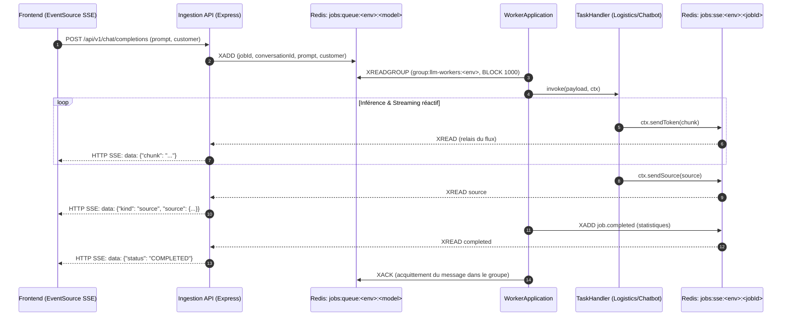
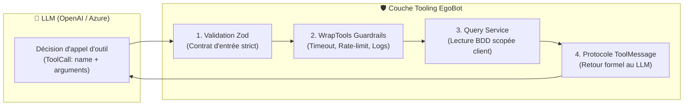

# ⚙️ `@egobot/worker` — Worker d'Inférence & Orchestration Tooling

Le **Worker d'Inférence** est le cœur décisionnel et analytique du projet **EgoBot**. Il consomme de manière asynchrone les requêtes utilisateurs publiées dans des flux **Valkey / Redis Streams**, orchestre des agents intelligents basés sur **LangChain** et **OpenAI / Azure OpenAI**, exécute des outils métiers typés (**Tool Calling**) avec des garde-fous de production (rate-limiting, timeouts), et retransmet la réponse en streaming temps réel (**Server-Sent Events**) avec des composants visuels riches (**Chart.js**, **Mermaid**) et des puces de sources interactives.

---

## 📑 Table des Matières

1. [Vue d'Ensemble & Architecture du Worker](#1-vue-densemble--architecture-du-worker)
2. [Cycle de Vie d'un Job & Mécanique Valkey Streams](#2-cycle-de-vie-dun-job--mécanique-valkey-streams)
3. [Architecture Détaillée du Tool Calling (`call_tooling`)](#3-architecture-détaillée-du-tool-calling-call_tooling)
4. [Interception & Rendu Riche Déterministe (Chart.js, Mermaid, Sources)](#4-interception--rendu-riche-déterministe)
5. [Guide Pas-à-Pas : Ajouter un Nouveau Tool (`call_tooling`)](#5-guide-pas-à-pas--ajouter-un-nouveau-tool-call_tooling)
6. [Guide Pas-à-Pas : Ajouter une Nouvelle Source de Données au Worker](#6-guide-pas-à-pas--ajouter-une-nouvelle-source-de-données-au-worker)
7. [Démarrage, Scripts & Tests du Worker](#7-démarrage-scripts--tests-du-worker)

---

## 1. Vue d'Ensemble & Architecture du Worker

Le worker est une application autonome en **TypeScript pur** s'appuyant sur `@egobot/sdk/worker` et `@egobot/logistics-agent`.

```text
apps/worker/
├── src/
│   ├── handlers/
│   │   ├── logistics.handler.ts       # Orchestrateur du modèle LOGISTICS (LangChain + Tools + Streaming)
│   │   └── logistics.handler.test.ts  # Tests unitaires du handler avec mocks
│   ├── rich-content/
│   │   ├── build-rich-content-block.ts # Générateur déterministe Chart.js / Mermaid & mapping des sources
│   │   └── build-rich-content-block.test.ts # Tests de non-régression des blocs graphiques
│   ├── index.ts                       # Point d'entrée, initialisation du WorkerApplication & signaux système
│   └── __tests__/
│       ├── worker.test.ts             # Tests d'intégration du cycle d'inférence
│       └── run-all-tests.ts           # Runner de tests
├── Dockerfile.dev                     # Image de développement avec tsx watch
├── Dockerfile.prod                    # Image optimisée multi-stage de production
└── package.json
```

---

## 2. Cycle de Vie d'un Job & Mécanique Valkey Streams

Le worker s'exécute en continu et communique avec le reste de l'écosystème via **Valkey / Redis Streams** :



### Concepts Clés de Résilience

1. **Consumer Groups (`group:llm-workers:<env>`)** : Plusieurs instances du worker peuvent écouter la même file en parallèle pour répartir la charge sans duplication.
2. **Récupération des Jobs Orphelins (PEL Recovery via `XAUTOCLAIM`)** : Toutes les 30 secondes, le worker vérifie si des messages sont restés non acquittés depuis plus de 60 secondes (par exemple suite au crash inopiné d'un conteneur) et les réattribue automatiquement.
3. **Dead Letter Queue (DLQ)** : Si le traitement d'un message échoue 3 fois consécutives, le message est redirigé vers `<streamKey>:dlq` avec la trace d'erreur et un timestamp ISO, puis acquitté pour débloquer la file.
4. **Heartbeat & Présence** : Toutes les 5 secondes, le worker rafraîchit une clé `workers:presence:<workerId>:<model>` avec un TTL de 15s. L'API sait ainsi en temps réel quels modèles disposent de workers actifs.
5. **Gestion de l'Annulation (`ctx.checkCancellation()`)** : Si l'utilisateur clique sur le bouton « Arrêter la réponse » ou ferme son onglet, une clé `jobs:cancel:<jobId>` est écrite. Le worker l'interroge régulièrement et stoppe immédiatement les appels au LLM pour économiser les quotas.

---

## 3. Architecture Détaillée du Tool Calling (`call_tooling`)

Le **Tool Calling** (appel d'outils) permet au modèle de langage d'interagir de manière sécurisée avec le monde extérieur (bases de données, ERP, APIs externes) plutôt que de générer des réponses statiques ou d'halluciner des informations.

### Les 4 Piliers du Tooling EgoBot



### 1. Isolation Stricte du Contexte Client
Aucun outil ne demande au LLM de fournir l'identifiant du client (`customerId` ou `email`). Lors de la création des outils via `createLogisticsTools({ customer, prisma })`, le `customerId` authentifié est capturé dans une closure. Le LLM ne peut donc techniquement **jamais** interroger les commandes ou adresses d'un autre utilisateur.

### 2. Le Guardrail `wrapTools` (`packages/logistics-agent/src/tools/tool-wrapper.ts`)
Chaque outil est systématiquement encapsulé par `wrapTools` qui applique :
- **Journalisation structurée** : Logue le nom de l'outil, ses entrées JSON, sa durée en ms et le statut (`OK` ou `ERREUR`).
- **Timeout garanti (`timeoutMs`)** : Exécute l'outil via `Promise.race` contre un minuteur (par défaut 5000 ms). Si la base ou l'API externe ne répond pas, l'outil est interrompu sans bloquer l'agent.
- **Rate-limiting par interaction (`maxCalls`)** : Empêche un modèle de boucler à l'infini sur le même outil.
- **Conformité au protocole `ToolMessage`** : Lorsqu'un appel comporte un `tool_call_id` émis par OpenAI / Azure, `wrapTools` intercepte les erreurs et renvoie un `ToolMessage` formaté avec `status: "error"`. Cela évite de rompre la chaîne d'appels attendue par les API de chat completion.

---

## 4. Interception & Rendu Riche Déterministe

L'une des innovations majeures d'EgoBot est la **séparation stricte entre le raisonnement textuel et la production visuelle** :

> ⚠️ **Règle absolue** : Les graphiques Chart.js et les diagrammes Mermaid ne sont **jamais** générés par le LLM.

Dans `apps/worker/src/handlers/logistics.handler.ts`, le worker consomme le flux d'événements de l'agent (`agent.streamEvents`) sur deux canaux parallèles :

```typescript
await Promise.all([
  // Canal 1 : Streaming des mots du LLM vers l'utilisateur
  (async () => {
    for await (const msg of run.messages) {
      for await (const token of msg.text) {
        if (await ctx.checkCancellation()) return;
        await ctx.sendToken(token);
      }
    }
  })(),
  // Canal 2 : Interception déterministe des sorties d'outils
  (async () => {
    for await (const call of run.toolCalls) {
      const output = await call.output;
      // Construction garantie d'un bloc Chart.js ou Mermaid à partir du DTO typé
      const block = buildRichContentBlock(call.name, output);
      if (block) {
        await ctx.sendToken(block);
      }
      // Collecte de la puce de source associée
      const source = getToolSource(call.name, output);
      if (source && !seenTitles.has(source.title)) {
        seenTitles.add(source.title);
        detectedSources.push(source);
      }
    }
  })(),
]);
```

- **Si `get_product_availability` est invoqué** : `buildRichContentBlock` produit un bloc ` ```chart ` avec les vrais chiffres de la table SQL (en stock, réservé, disponible, seuil de sécurité).
- **Si `get_delivery_tracking` ou `get_order_status` est invoqué** : `buildRichContentBlock` produit un automate ` ```mermaid ` de type `stateDiagram-v2` mettant en évidence l'étape actuelle du colis ou de la commande.
- **Puces de sources** : À la fin de la réponse, le worker émet via `ctx.sendSource(...)` les puces interactives (ex: « Espace Client — Profil », « Suivi des Expéditions ») affichées au bas de la bulle de chat.

---

## 5. Guide Pas-à-Pas : Ajouter un Nouveau Tool (`call_tooling`)

Ce guide vous accompagne pour ajouter un nouvel outil au worker, par exemple un outil `get_invoice_pdf` permettant de récupérer la facture d'une commande.

### Étape 1 : Définir le Schéma Zod d'Entrée
Ouvrir `packages/logistics-agent/src/tools/schemas.ts` et ajouter le contrat d'entrée :

```typescript
import { z } from "zod";

export const invoicePdfInputSchema = z.object({
  orderNumber: z
    .string()
    .min(1, "Le numéro de commande est requis.")
    .describe("Numéro de la commande dont on souhaite télécharger la facture (ex: CMD-2026-000042)."),
});

export type InvoicePdfInput = z.infer<typeof invoicePdfInputSchema>;
```

### Étape 2 : Implémenter la Méthode Métier dans le Service
Ajouter la logique de récupération dans le service correspondant (ex: `packages/logistics-agent/src/services/order.service.ts`) :

```typescript
export class OrderService {
  // ...
  async getInvoice(customerId: string, orderNumber: string) {
    const order = await this.prisma.order.findFirst({
      where: { customerId, orderNumber },
      select: { id: true, orderNumber: true, totalIncludingTax: true, createdAt: true },
    });

    if (!order) {
      return { found: false, message: `Aucune commande ${orderNumber} trouvée pour ce compte.` };
    }

    return {
      found: true,
      invoiceNumber: `FACT-${order.orderNumber.replace("CMD-", "")}`,
      downloadUrl: `https://billing.egobot.local/invoices/${order.id}.pdf`,
      totalAmount: order.totalIncludingTax,
    };
  }
}
```

### Étape 3 : Créer l'Outil LangChain
Dans `packages/logistics-agent/src/tools/order.tools.ts` :

```typescript
import { tool } from "langchain";
import { invoicePdfInputSchema } from "./schemas.js";

export function createOrderTools(customer: AuthenticatedCustomer, orderService: OrderService) {
  // ... autres outils ...

  const getInvoicePdf = tool(
    ({ orderNumber }) => orderService.getInvoice(customer.customerId, orderNumber),
    {
      name: "get_invoice_pdf",
      description: "Retourne le lien de téléchargement sécurisé de la facture d'une commande du client.",
      schema: invoicePdfInputSchema,
    }
  );

  return [
    // ...
    getInvoicePdf,
  ];
}
```

### Étape 4 : Enregistrer l'Outil et son Quota dans `wrapTools`
Dans `packages/logistics-agent/src/tools/create-logistics-tools.ts` :

```typescript
return wrapTools(allTools, {
  // ...
  get_invoice_pdf: { maxCalls: 3, timeoutMs: 4000 },
});
```

### Étape 5 : Associer une Source UI et un Rendu Graphique (Optionnel)
Dans `apps/worker/src/rich-content/build-rich-content-block.ts` :

```typescript
export function getToolSource(toolName: string, output: unknown): SourceData | null {
  // ...
  switch (toolName) {
    case "get_invoice_pdf":
      return {
        title: "Portail Facturation & Comptabilité",
        type: "doc",
      };
    // ...
  }
}
```

### Étape 6 : Tester le Nouvel Outil
Ajouter un test unitaire dans `packages/logistics-agent/src/tools/logistics-tools.test.ts` :

```typescript
it("expose le nouvel outil get_invoice_pdf", () => {
  const tools = createLogisticsTools({ customer: mockCustomer, prisma: mockPrisma });
  const names = tools.map((t) => t.name);
  expect(names).toContain("get_invoice_pdf");
});
```

---

## 6. Guide Pas-à-Pas : Ajouter une Nouvelle Source de Données au Worker

Le worker ne se limite pas à SQLite ! Vous pouvez facilement connecter une API REST tierce (transporteur, météo, ERP SAP), une base PostgreSQL dédiée, un cluster MongoDB ou un index vectoriel.

### Cas d'Usage : Connecter une API REST de Suivi Transporteur (ex: Chronopost / Colissimo)

#### 1. Déclarer la Configuration d'Environnement
Dans votre fichier `/.env` unique à la racine du monorepo :

```dotenv
CARRIER_API_BASE_URL="https://api.carrier.example.com/v1"
CARRIER_API_KEY="secret_api_key_carrier"
```

#### 2. Créer le Client et le Service de Requête
Créer un nouveau fichier `packages/logistics-agent/src/services/carrier-api.service.ts` :

```typescript
export interface CarrierTrackingResponse {
  trackingNumber: string;
  status: "IN_TRANSIT" | "DELIVERED" | "DELAYED";
  location: string;
  lastCheckpoint: string;
}

export class CarrierApiService {
  private baseUrl: string;
  private apiKey: string;

  constructor(
    baseUrl = process.env.CARRIER_API_BASE_URL || "https://api.carrier.example.com/v1",
    apiKey = process.env.CARRIER_API_KEY || ""
  ) {
    this.baseUrl = baseUrl;
    this.apiKey = apiKey;
  }

  async getLiveStatus(trackingNumber: string): Promise<CarrierTrackingResponse | null> {
    try {
      const res = await fetch(`${this.baseUrl}/track/${encodeURIComponent(trackingNumber)}`, {
        headers: {
          Authorization: `Bearer ${this.apiKey}`,
          Accept: "application/json",
        },
      });

      if (!res.ok) return null;
      return (await res.json()) as CarrierTrackingResponse;
    } catch (err) {
      console.error(`[CarrierApiService] Erreur réseau pour ${trackingNumber}`, err);
      return null;
    }
  }
}
```

#### 3. Créer l'Outil LangChain Utilisant la Nouvelle Source
Créer `packages/logistics-agent/src/tools/carrier.tools.ts` :

```typescript
import { tool } from "langchain";
import { z } from "zod";
import type { CarrierApiService } from "../services/carrier-api.service.js";

const carrierInputSchema = z.object({
  trackingNumber: z.string().describe("Numéro de colis transporteur (ex: 6A12345678901)"),
});

export function createCarrierTools(carrierService: CarrierApiService) {
  const getLiveCarrierStatus = tool(
    async ({ trackingNumber }) => {
      const data = await carrierService.getLiveStatus(trackingNumber);
      if (!data) {
        return { found: false, message: `Aucune information transporteur pour le colis ${trackingNumber}.` };
      }
      return { found: true, ...data };
    },
    {
      name: "get_live_carrier_status",
      description: "Interroge l'API du transporteur en temps réel pour obtenir la position GPS et le statut du colis.",
      schema: carrierInputSchema,
    }
  );

  return [getLiveCarrierStatus];
}
```

#### 4. Injecter la Source dans l'Agent du Worker
La fonction `createLogisticsAgent` accepte une option `extraTools` conçue pour recevoir vos outils personnalisés sans modifier le cœur de l'agent :

```typescript
// (Pensez à exporter votre service dans packages/logistics-agent/src/services/index.ts
//  et vos outils dans packages/logistics-agent/src/tools/index.ts)

// Dans apps/worker/src/handlers/logistics.handler.ts (ou votre propre factory) :
import { createLogisticsAgent } from "@egobot/logistics-agent/agent";
import { CarrierApiService } from "@egobot/logistics-agent/services";
import { createCarrierTools } from "@egobot/logistics-agent/tools";

const carrierService = new CarrierApiService();
const carrierTools = createCarrierTools(carrierService);

// Passer les outils personnalisés à l'agent logistique :
const agent = createLogisticsAgent({
  customer: resolution.customer,
  prisma,
  extraTools: carrierTools,
});
```

#### 5. Émettre la Source Interactive dans le Frontend
Dans `apps/worker/src/rich-content/build-rich-content-block.ts` :

```typescript
case "get_live_carrier_status":
  return {
    title: "API Temps Réel Transporteur",
    type: "api",
    url: "https://carrier.example.com/tracking",
  };
```

Dès que l'agent invoque l'outil, l'utilisateur voit apparaître en fin de message une puce cliquable avec le badge `[API]` pointant vers le site officiel du transporteur.

> [!IMPORTANT]
> **Prise en compte des modifications dans le Monorepo :**
> - **En mode Natif** : Le worker consomme `@egobot/logistics-agent` via son build TypeScript. Après tout ajout ou modification d'outils dans `packages/logistics-agent`, lancez la compilation :
>   ```bash
>   pnpm --filter @egobot/logistics-agent build
>   ```
> - **Sous Docker Compose Dev** : Le conteneur monte `apps/worker/src` mais pas le dossier `packages/`. Relancez `pnpm dev:build` pour régénérer le conteneur avec le package à jour.
> - **Test rapide en CLI sans interface** : Pour tester immédiatement votre nouvel outil sans lancer Valkey ni le Web, utilisez le script interactif :
>   ```bash
>   pnpm try:agent CLI-000001 "Quel est le statut de mon colis 6A12345678901 ?"
>   ```

---

## 7. Démarrage, Scripts & Tests du Worker

### Commandes Utiles

```bash
# Lancer le worker en mode développement autonome (avec rechargement automatique à chaud)
pnpm --filter @egobot/worker dev

# Compiler le worker en TypeScript vers apps/worker/dist
pnpm --filter @egobot/worker build

# Exécuter les tests unitaires et d'intégration du worker
pnpm --filter @egobot/worker test

# Exécuter les tests du package logistics-agent associé
pnpm --filter @egobot/logistics-agent test
```

### Variables d'Environnement Clés pour le Worker

| Variable | Description | Valeur par Défaut |
| :--- | :--- | :--- |
| `VALKEY_URL` ou `REDIS_URL` | URL de connexion au broker Valkey Streams | `redis://localhost:6379` |
| `NODE_ENV` | Détermine le préfixe de file (`jobs:queue:<env>:*`) | `development` (mappé en `dev`) |
| `LOGISTICS_MODEL_PROVIDER` | Fournisseur du modèle de langage | `openai` ou `azure` |
| `LOGISTICS_MODEL` | Modèle de raisonnement utilisé | `gpt-5` |
| `OPENAI_API_KEY` | Clé d'authentification OpenAI | *(Obligatoire si provider openai)* |
| `LOGISTICS_DATABASE_URL` | Fichier SQLite ou connexion BDD logistique | `file:./packages/logistics-agent/logistics.db` |

---

## 🛡️ Bonnes Pratiques pour Développeurs Externes

- **Ne jamais court-circuiter `wrapTools`** : Toute nouvelle fonction outil doit passer par `wrapTools` pour garantir des timeouts stricts et éviter les dépenses de tokens imprévues en production.
- **Règles d'or des descriptions d'outils** : Le LLM sélectionne l'outil uniquement sur la base de sa description (`description`). Rédigez-la toujours en français clair, en décrivant explicitement son périmètre et ses arguments.
- **Anti-hallucination** : Si un produit, une commande ou un colis n'existe pas dans votre source de données, retournez toujours `{ found: false, message: "..." }`. L'agent est instruit dans son prompt système pour relayer fidèlement cette absence au client.
